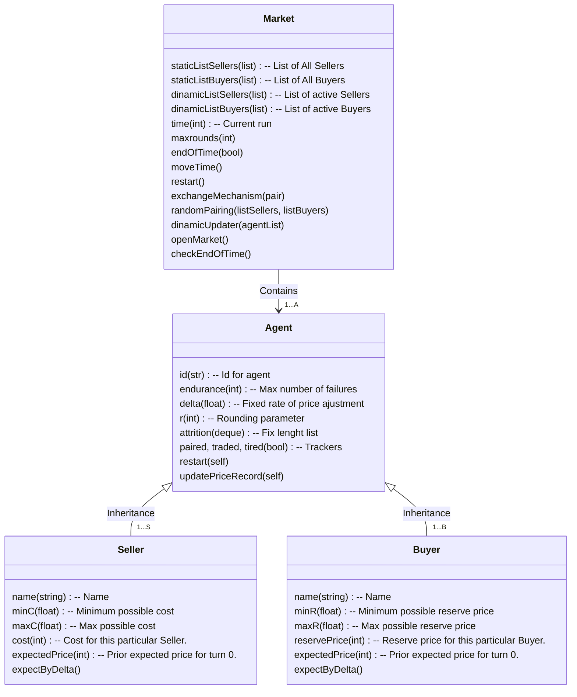
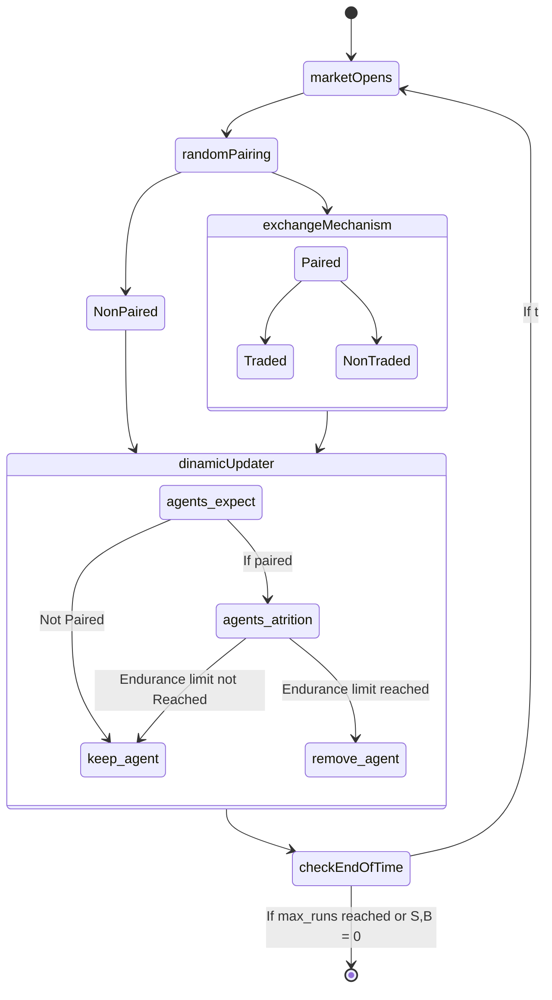

# Simulación de Mercado en Python

## Nicolás Harari

###  Resumen

En el siguiente trabajo se considera un modelo simple de mercado donde una población de $n$ vendedores y $m$ compradores heterogéneos deciden si intercambiar o no una única unidad de un bien homogéneo.  El precio de intercambio se actualizará periodo a periodo, conforme los agentes actualizan sus precios esperados para cada periodo. Los resultados presentados al final del trabajo fueron obtenidos utilizando el lenguaje de programación `python`, cuyo código es elaboración personal que se puede encontrar [aquí](https://github.com/ndharari/MarketSimulation]). Allí se puede encontrar que el modelo logra replicar el resultado esperado por los modelos de mercado tradicionales: las cantidades relativas de compradores y vendedores cumplen un rol fundamental a la hora de definir el precio de equilibrio emergente. A través de las simulaciones, se encuentra que mientras que todos los agentes en $t_0$ puedan obtener beneficios de intercambio el precio de equilibrio final estará cercano al precio máximo (o mínimo) que está dispuesto a pagar el $|n-m|$ -avo individuo, ordenados por sus disposiciones de mayor a menor (en caso de haber más vendedores que compradores, se presenta el caso contrario) En las oportunidades donde las cantidades son idénticas, el precio de equilibrio es intermedio.

### Introducción (Estado del Arte) 

 

1. Que es un AMB
2. Que es "complexity economics"
   - Escapando el Equilibrio
3. Que se busca en un modelo de agentes
4. Otros modelos clásicos de agentes 
5. Citar Heymann et al 2014

<!--AMB es un tipo de simulación, la conducción de una modelización de un sistema con datos de entrada para observar las salidas correspondientes (Bratley, Schrage & Fox, 1987). Recientemente se la ha presentado como una tercera metodología científica, como punto medio entre la deducción y la inducción. De forma análoga a la deducción parte de un conjunto explícito de supuestos, pero a diferencia de ésta, no busca probar teoremas, sino que puede generar grandes cantidades de datos que puede ser analizado de forma inductiva.--> 

<!--El caso específico de la modelización basada en agentes resulta útil para analizar sistemas compuestos por una multiplicidad de agentes individuales, consumidores, empresas, gobiernos, unidades de investigación, etc., que interactúan entre ellos y en los que se puede apreciar que de aquellas relaciones se da una emergencia de propiedades que no pueden ser deducidas previamente por el agregamiento de las propiedades individuales (Axelrod, 1997). En otras palabras, efectos a gran escala que emergen de relaciones micro. Esto ocurre específicamente cuando la interacción entre los agentes es contingente a experiencias pasadas, es decir, si estos tienen la capacidad de adaptarse continuamente a distintos contextos. Es en este contexto que AMB resulta esencial, considerando que el análisis matemático convencional presenta dificultades.-->

<!--Al iterar el modelo sobre distintos valores de variables pseudoaleatorias, se puede construir una recopilación de *historias* (Axelrod & Tesfatsion, 2006) que en el agregado de simulaciones, pueden revelar patrones generales desde reglas relativamente simples de comportamiento. Esto ocurre porque, aunque el investigador conozca las reglas iniciales de comportamiento de los agentes aquello no implica que se conozcan los resultados debido a la característica emergente de los sistemas estudiados que hacen impredecibles para el investigador las configuraciones finales. El gran beneficio con el que cuenta esta metodología de investigación es que también es posible iterar sobre distintos valores predefinidos de las variables de política, obteniendo respuestas al sistema frente a cambios marginales y proporcionando de esta forma posibles experimentos controlados auto encapsulados (Axelrod & Tesfatsion, 2006). De esto se desprende que la complejidad de los ABM debe estar en los resultados del modelo, no en sus condiciones iniciales. De la misma forma que los modelos clásicos económicos, el objetivo no es ofrecer una representación perfecta de la dinámica de estudio, sino encontrar posibles dinámicas que pueden resultar de las relaciones entre los distintos agentes (Axelrod, 1997).-->

###  El Modelo

Se propone un mercado donde un conjunto fijo de $A$ agentes heterogéneos, entre ellos vendedores $S$ y consumidores $B$ con $A = \{s_1,... s_n; \ b_1, ... b_m\}$ , deciden en cada periodo $t \in {1, 2, ... \ T}$ si intercambiar o no una única unidad de un bien homogéneo. Ambos grupos operan de forma atomizada e independiente por lo que no hay posibilidad de cartelización o acuerdos tanto en la oferta como en la demanda. No se consideran funciones de producción, ganancias, ni riqueza: periodo a periodo los vendedores tendrán bienes a su disposición para vender y consumidores dinero para intercambiar por ellos. Se asume que cada individuo tiene una utilidad de reserva $U$ medida en términos monetarios que representa -en el caso del vendedor $s_i$ - el costo mínimo $c_i$ por el que está dispuesto a desprenderse del bien en cuestión, mientras que en el caso del comprador $b_j$ el precio máximo idiosincrático $r_j$ dispuesto a pagar por el mismo.   Estos valores son elegidos de manera aleatoria para cada jugador de forma que $\forall i, c_i \in \left[\underline{c}, \overline{c}\right]$ y  $\forall j, r_j\in \left[\underline{r}, \overline{r}\right]$, donde $\underline{c}, \overline{c}; \ \underline{r}, \overline{r}$ son los valores mínimos y máximos posibles.  En el contexto del siguiente trabajo, $\overline{c}< \underline{r}$ por lo que para cualquier valor de U los agentes podrían encontrar beneficios de intercambio.

En el inicio del juego, los agentes tienen un *prior* del precio esperado para el primer periodo, $p_{s, 1}, p_{b, 1}$, que representa un valor que creen *justo* por el bien en ese periodo. Este valor no puede ser mayor (o menor) que su utilidad de reserva, porque ningún agente puede pensar que el precio justo de un bien es mayor (menor) al que pagarían (recibirían) por él. Por este motivo, el *prior* individual se obtiene de forma aleatoria donde $\forall i \  p_{s_i, 1}  \in \left[c_i, \overline{c}\right]$, como también,  $\forall j, p_{b_j, 1}\in \left[\underline{r}, r_j\right]$. Esto implica, en el caso del vendedor, que su *prior* estará dentro del intervalo delimitado por el costo máximo posible y su propio costo. 

Al inicio de cada ronda, los jugadores se aproximan al Mercado, el cual los aparea de forma aleatoria hasta agotar el numero de compradores o vendedores. En el caso en el que los conjuntos no tengan el mismo tamaño, habrá $|n-m|$ individuos que quedarán automáticamente fuera de las negociaciones. De esto se infiere fácilmente que para un determinado periodo no puede ocurrir que simultáneamente individuos de ambos conjuntos queden sin pareja.

Una vez de a pares, cada jugador le informa al Mercado su precio de venta propuesto $p_{s_i, t};p_{b_j, t} $ de acuerdo a cuanto consideran que podrían intercambiar el producto en el turno $t$. El Mercado observa los precios y declara una transacción de cumplirse la siguiente condición:
$$
\text{Condición de intercambio en  $t$ entre  $s_i$ y $b_j$} \\
p_{s_i, t}\leq p_{b_j, t}
$$

Acto seguido, se realizará el intercambio. Una vez que todos los pares deciden si realizar o no la transacción, ambas partes se separan y todos los agentes que participaron en el mercado en $t$ - agrupados o no - reevalúan sus expectativas de precios para el siguiente periodo y deciden si continuarán participando en el mismo. El juego continúa hasta que terminen los turnos o hasta que no reste un número positivo de vendedores o consumidores. 

Resulta importante notar que el precio efectivo al que se realiza el intercambio en cada periodo, que de cumplirse la  de cumplirse la condición estará en el intervalo $\left[p_{s_i, t} ; p_{b_j, t}\right]$ no resulta relevante, ya que se busca se busca modelar como los agentes reevalúan sus precios esperados periodo a periodo. Otro aspecto central es que la condición de intercambio en $t$ es estáticamente independiente de las utilidades $U$ (costos, precios de reserva) generales de los agentes. Es decir, una vez definidos ambos precios esperados - cuyas mecánicas de ajuste se explicarán en el siguiente apartado - como los consumidores no reevalúan sus expectativas hasta el siguiente periodo, si $b_j$ se encuentra frente a un precio tal que $ r_j > p_{s_i, t} > p_{b_j, t} $ no comprará el bien aún cuando su precio es menor que el que estaría dispuesto a pagar, el Mercado no habilita la transacción. Esto ocurre porque el individuo, de aceptar un precio superior a $p_{b_j, t}$ sentiría que en ese periodo está siendo engañado y que es posible conseguir el bien por un precio menor. Por lo tanto, el Mercado prohíbe la transacción y este, luego de reevaluar sus expectativas, volverá a buscar una mejor oferta en el periodo siguiente.

#### Ajuste de expectativas

Como se explicó en el apartado anterior, los agentes reevalúan periodo a periodo el precio que creen justo. Se adopta una regla simple para realizar este ajuste: de haber intercambiado en $t$, los agentes consideran el resultado como una señal de que posiblemente no fueron suficientemente duros en sus condiciones; en $t+1$ serán más exigentes. En el caso del vendedor (comprador), esto se traduce en aumentar (disminuir) los precios para el periodo siguiente en una cantidad $\Delta\in [0,1]$. Sin embargo, de no haber resultado exitoso el intercambio (o de no haber logrado conseguir pareja) los agentes retornarán el periodo consecuente menos exigentes: los vendedores (consumidores) bajarán (subirán) su precio esperado. No obstante, debido a que los vendedores tienen un costo $c_i$ debajo del cual no estarán dispuestos a ofrecer su bien y los consumidores un precio de reserva $r_j$ por encima del cual no estarán dispuestos a adquirirlo, la actualización del precio esperado por periodo se definirá de la siguiente manera:

>###### Ajuste de precios del vendedor
>$$
\begin{equation}
p_{s_i, t+1} = \left\{
\begin{array}{ll}
p_{s_i, t} +\Delta & {\textrm{si se efectúa el intercambio}} \\
{\max{\{ p_{s_i, t} -\Delta}; \ c_{i}\}}  & {\textrm{si no se efectúa el intercambio}} \\
\end{array}\right.
\end{equation}
>$$
>Donde el precio esperado no puede resultar menor que el costo individual.
>

>###### Ajuste de precios del comprador
>
>$$
\begin{equation}
p_{b_j, t+1} = \left\{
\begin{array}{ll}
p_{j_i, t} - \Delta & {\textrm{si se efectúa el intercambio}} \\
{\min{\{ p_{b_j, t} + \Delta}; \ r_{j}\}}  & {\textrm{si no se efectúa el intercambio}} \\
\end{array}\right.
\end{equation}
>$$
>
> Donde el precio esperado no puede resultar mayor al precio de reserva.

Por otro lado, se asume que los individuos mantienen cierta aversión a participar en el mercado y no lograr un intercambio. Sea entonces $ e \in \Z $ un parámetro de la resistencia de los individuos al fracaso, representando el número máximo de turnos consecutivos en los cuales el individuo formó parte de un par y no logró cerrar un intercambio. Este parámetro resulta esencial para asegurar el funcionamiento del modelo. Cuando los pares se forman, los individuos no tienen forma de reconocer a su interlocutor, sólo reciben del Mercado la confirmación - o negación- del intercambio. Suponga el escenario donde existe un vendedor con un costo alto $s_i(\hat{c})$ y el precio esperado del resto de los agentes es menor. Un comprador cualquiera, de encontrarse con $s_i(\hat{c})$ no puede identificar si el rechazo del intercambio ocurre porque el precio que demanda es demasiado exigente *en general* o sólo *en este caso particular*. De no limpiarse el mercado de aquellos consumidores con $U$ prohibitivos, la dinámica de precios esperados se mantiene indefinidamente en valores intermedios y las diferencias de cantidades de compradores y vendedores no se logran generar ==(Hacer grafico)==. De esta condición surge una importante salvedad: el juego terminará o bien al alcanzarse el número máximo de turnos o bien cuando de algún grupo (compradores, vendedores) ya no queden participantes.

En el contexto del siguiente trabajo, tanto $e$ como $\Delta$ resultan parámetros generales del modelo comunes a todos los agentes, tanto consumidores como vendedores. Los costos y precios de reserva marcan la heterogeneidad de los agentes. En resumen, cada agente tiene tres características individuales que mantienen a lo largo del juego,  $U$- costo $c_i$ para vendedores y precio de reserva $r_j$ para compradores-, el parámetro de ajuste $\Delta$ por el cual actualizan el precio esperado y la resistencia a la deserción $ e \in \Z $ (*endurance*). Finalmente, cada jugador tiene un precio esperado que considera *"justo"* para cada periodo. A continuación se expone la implementación del modelo y las dinámicas encontradas. 

### Implementación

El presente trabajo utiliza el lenguaje de programación Python para generar las simulaciones del modelo. Este es un lenguaje *open-source* que tiene como foco la legibilidad de su código y la simpleza de sus operativos. Como lenguaje soporta distintos estilos de programación, entre los cuales se encuentra la orientada a objetos (*object oriented programing* o OOP) que es útil para realizar simulaciones basadas en agentes. Esto es porque es posible definir *clases* que funcionan como modelos para inicializar multiplicidad de instancias o realizaciones distintas, *objetos* (Sargent & Stachurski, 2015). Cada objeto cuenta con *atributos* (datos) y *métodos* (funciones) que reflejan una estructura común. Así, es simple proponer una multiplicidad de actores que compartan características similares, pero con diferentes valores particulares. 

Siguiendo esta línea conceptual, se consideran cuatro *clases* dentro de la implementación, el mercado, cuyo rol es el de facilitar el intercambio entre los consumidores - vendedores, ambos tipos distintos de agentes, una clase en sí misma. A continuación se puede observar la estructura del sistema y sus relaciones 

La clase `market` es la principal del modelo: contiene a los agentes, los aparea, obtiene sus precios esperados y les comunica a los agentes si se realiza el intercambio. Antes de finalizar cada periodo, prepara a los agentes para el periodo posterior, haciendo que estos reevalúen sus expectativas y echa a quienes hayan alcanzado la resistencia máxima. Finalmente, luego de controlar que el número de compradores y vendedores sea mayor a cero - y de no haber alcanzado la cantidad máxima de rondas- avanza el tiempo. Por su parte cada uno de los distintos `Agent` genera sus parámetros individuales de forma aleatoria como también  actualiza y almacena la sucesión de precios esperados de cada periodo. A continuación un diagrama que muestra la secuencia de estados del sistema:

Finalmente, es necesario mencionar un parámetro que cumple un rol meramente operacional: `round`, el redondeo o resolución del sistema. Al trabajar con realizaciones específicas y como el ajuste esta dado por la suma de un $\Delta$ específico, se decide por simplicidad que todos los valores de costos, precios de reserva y precios esperados sean múltiplos de este valor.  Esta decisión no afecta el resultado de la simulación sino que sirve para facilitar el análisis.

Los parámetros iniciales para ambos grupos son los siguientes:

| Comprador             | Vendedor | Mercado |
| :-------------------: | :------: | :-----: |
| $\underline{c} = 10 $ |  $\underline{r} = 20 $        | $T=50$ |
| $\overline{c}=20$     | $\overline{r}=30$          |  |
| $\alpha=0.05$         |   $\alpha=0.05$        |         |
| $e=3$                 |   $e=3$           |         |
| `round` $=0$          |  `round` $=0$           |         |

Se adjunta en el apéndice el código en su totalidad, como también puede encontrarse [aquí](https://github.com/ndharari/MarketSimulation]). Los gráficos presentados a continuación se realizaron utilizando los paquetes `altair` y `matplotlib`, mientras que el resto del código es elaboración personal.

### Resultados

En escencia las espectativas de los agentes se alinean entre los grupos e intra grupos. 

### Anexo

INSERT CODE

### Bibliografía

