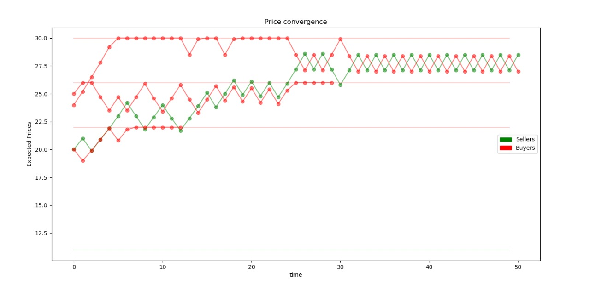
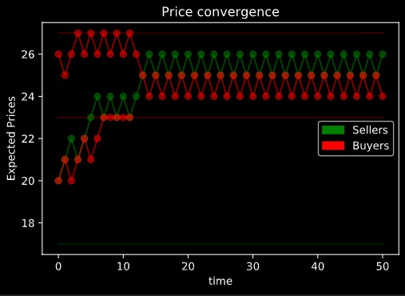
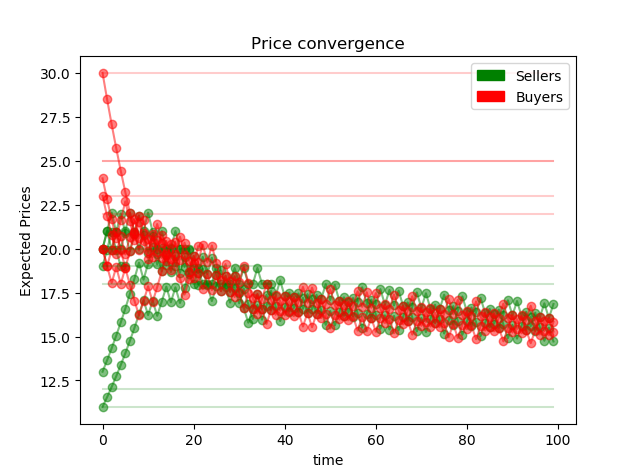

# Simulación de Mercado en Python

## Nicolás Harari

###  Introducción

A continuación se presenta una modelización de mercado basada en agentes en Python. Mediante un modelo simple de doble subasta con ajuste secuencial se mostrará que las cantidades relativas de $m$ compradores y $n$ vendedores son importantes a la hora de definir el precio de equilibrio de mercado. Se encontrará que mientras el conjunto de costos  sea menor en su totalidad al de precios de reserva (asegurando que todos los compradores puedan, *a priori* consumir el bien - y viceversa) el precio de equilibrio estará cercano al precio máximo (o mínimo) que está dispuesto a pagar el $|n-m|$ -último individuo, ordenados por sus disposiciones de mayor a menor (en caso de haber más vendedores que compradores, se presenta el caso contrario)  En las oportunidades donde las cantidades son idénticas, el precio de equilibrio es intermedio.
La intención final del trabajo es presentar estas tres situaciones y lograr una representación del los equilibrios obtenidos gráficamente.

###  El Modelo

Se propone un mercado donde un conjunto fijo de $A$ agentes heterogéneos, entre ellos vendedores $S$ y consumidores $B$ con $A = {s_1, s_2,... s_n; b_1, b_2, ... b_m}$ deciden en cada periodo $t \in {1, 2, ...T}$ si intercambiar o no una única unidad de un bien homogéneo. Ambos grupos operan de forma atomizada e independiente por lo que no hay posibilidad de cartelización o acuerdos tanto en la oferta como en la demanda. No se consideran funciones de producción, ganancias,  ni riqueza: periodo a periodo los vendedores tendrán bienes a su disposición para vender y consumidores dinero para intercambiar por ellos. Se asume que cada individuo tiene una utilidad de reserva $U$ medida en términos monetarios que representa -en el caso del vendedor $s_i$- el costo mínimo $c_i$ por el que está dispuesto a desprenderse del bien en cuestión, mientras que en el caso del comprador $b_j$ el precio máximo idiosincrático $r_j$ dispuesto a pagar por el mismo.

Al inicio de cada ronda de mercado, los jugadores forman pares de forma aleatoria hasta agotar el numero de compradores o vendedores. En el caso en el que los conjuntos no tengan el mismo tamaño, $n \neq m$, habrá $|n-m|$ individuos que quedarán automáticamente fuera de las negociaciones. De esto se infiere fácilmente que para un determinado periodo no puede ocurrir que simultáneamente individuos de ambos conjuntos queden sin pareja.  

Una vez de a pares, cada vendedor $s_i$ propone un precio de venta $p_{s_i, t}$ de acuerdo a cuanto consideran que podrían vender su producto en el turno $t$. Los compradores observan este precio y lo comparan con su propio precio esperado $p_{b_j, t}$. De cumplirse la siguiente condición

$$
\text{Condición de intercambio en  $t$ entre  $s_i$ y $b_j$} \\
p_{s_i, t}\leq p_{b_j, t}
$$

los agentes realizarán el intercambio a precio $p=p_{s_i, t}$. Es importante notar que la condición de intercambio en $t$ es estáticamente independiente de las utilidades $U$ (costos, precios de reserva) generales de los agentes. Es decir, una vez definidos ambos precios esperados - cuyas mecánicas de ajuste se explicarán en el siguiente apartado - como los consumidores no reevalúan sus expectativas hasta el siguiente periodo, si $b_j$ se encuentra frente a un precio tal que $ r_j > p_{s_i, t} > p_{b_j, t} $ no comprará el bien aún cuando su precio es menor que el que estaría dispuesto a pagar. Esto es porque cree que estaría siendo engañado y que es posible conseguir el bien por un precio menor. 

Una vez que todos los pares decidieron si realizar o no la transacción, ambas partes se separan y todos los agentes que participaron en el mercado en $t$ - agrupados o no - reevalúan sus expectativas de precios para el siguiente periodo y deciden si continuarán participando en el mismo. El juego continúa hasta que terminen los turnos o hasta que no reste un número positivo de vendedores o consumidores. 

#### Caracterización de los agentes

En el modelo, los agentes - vendedores y consumidores - tienen tres características individuales que los caracterizan: *utilidad* - *costo* $c_i$ para vendedores y precio de *reserva*  $r_j$ para compradores-,  la proporción  $\alpha\in [0,1]$ por la cual actualizan el precio esperado para el próximo periodo y la resistencia a la deserción $e\in \N$ (*endurance*). Como se explicó en el apartado anterior, los agentes reevalúan periodo a periodo el precio que creen justo correcto. Se adopta una regla simple para realizar este ajuste: de haber intercambiado en el periodo, los agentes consideran el resultado como una señal de que posiblemente no fueron **suficientemente duros** en sus condiciones por lo que las endurecen. En el caso del vendedor (comprador), esto se traduce en aumentar (disminuir) los precios para el periodo siguiente en una proporción $\alpha$. Sin embargo, de no haber resultado exitoso el intercambio (o de no haber logrado conseguir pareja) los agentes retornarán el periodo consecuente **menos exigentes:** los vendedores (consumidores) bajarán (subirán) su precio esperado. No obstante, debido a que los vendedores tienen un costo $c_i$ debajo del cual no estarán dispuestos a ofrecer su bien y los consumidores un precio de reserva $r_j$ por encima del cual no estarán dispuestos a adquirirlo, la actualización del precio esperado por periodo se definirá de la siguiente manera:


>###### Ajuste de precios del vendedor
>$$
\begin{equation*}
p_{s_i, t+1} = \left\{
\begin{array}{ll}
p_{s_i, t+1} \cdot (1+\alpha)  & {\textrm{si se efectúa el intercambio}} \\
{\max{\{ p_{s_i, t+1} \cdot (1-\alpha)}; \ c_{i}\}}   & {\textrm{si no se efectúa el intercambio}} \\
\end{array}\right.
\end{equation*}
>$$
>Donde el precio esperado no puede resultar menor que el costo individual.
>

>###### Ajuste de precios del comprador
>
>$$
\begin{equation*}
p_{b_j, t+1} = \left\{
\begin{array}{ll}
p_{j_i, t} \cdot (1-\alpha)  & {\textrm{si se efectúa el intercambio}} \\
{\min{\{ p_{b_j, t} \cdot (1+\alpha)}; \ r_{j}\}}   & {\textrm{si no se efectúa el intercambio}} \\
\end{array}\right.
\end{equation*}
>$$
>
> Donde el precio esperado no puede resultar mayor al precio de reserva.
> 

Por otro lado, se asume que los individuos mantienen cierta aversión a participar en el mercado y no lograr un intercambio. Sea entonces $e$ un parámetro de la resistencia de los individuos al fracaso, representando el número máximo de turnos consecutivos en los cuales el individuo **formó parte de un par y no logró cerrar un intercambio.**  En el contexto del siguiente trabajo, tanto $e$ como $\alpha$ resultan parámetros generales del modelo comunes a todos los agentes, tanto consumidores como vendedores. Los costos y precios marginales marcarán la heterogeneidad de los agentes. De esta forma, se definen los parámetros generales $\underline{c}, \overline{c}$ tal que $\forall i, c_i \in \left[\underline{c}, \overline{c}\right]$ y $\{\underline{r}, \overline{r}\}$ tal que $\forall j,  r_j\in \left[\underline{r}, \overline{r}\right]$.  Teniendo en cuenta los parámetros mencionados, en el próximo apartado se presenta una implementación usando el lenguaje de programación Python.

### Implementación

El presente trabajo utiliza el lenguaje de programación Python para generar las simulaciones del modelo. Para esto, se conceptualiza el mercado, los consumidores y los vendedores como *clases* de las cuales cada uno de los agentes será una instanciación. Los parámetros iniciales para ambos grupos son los siguientes:

| Comprador             | Vendedor | Mercado |
| :-------------------: | :------: | :-----: |
| $\underline{c} = 10 $ |  $\underline{r} = 20 $        | $T=50$ |
| $\overline{c}=20$     | $\overline{r}=30$          |  |
| $\alpha=0.05$         |   $\alpha=0.05$        |         |
| $e=3$                 |   $e=3$           |         |
| `round` $=0$          |  `round` $=0$           |         |

Donde el parámetro `round` representa el numero de decimales a usar cuando se redondea el resultado de los sucesivos ajustes. En la práctica, funciona como un intervalo adicional en el que los agentes consideran que el precio está "lo suficientemente" cerca de su precio esperado. De no agregarlo, pequeñas discrepancias entre precios esperados se magnifican a lo largo de los ciclos de ajuste, obteniendo resultados no deseados. Tanto los compradores como los vendedores individuales reciben una utilidad de reserva aleatoria siguiendo una distribución uniforme dentro de su respectivo intervalo. El precio inicial esperado es a su vez un número aleatorio dada una distribución uniforme entre el costo individual (precio reserva individual) y el costo máximo (precio de reserva mínimo). Se adjunta en el apéndice el código en su totalidad, como también puede encontrarse [aqui](https://github.com/ndharari/MarketSimulation). Los gráficos presentados a continuación se realizaron utilizando el paquete `matplotlib`, mientras que el resto del código es elaboración personal.

### Resultados Preliminares




  <p align="right">Simulación con 1 vendedor y 3 compradores.</p>  


<p align="right">Simulación con 2 compradores y 1 vendedor.</p> 




<p align="right">Simulación con 2 compradores y 1 vendedor.</p> 


<p align="right">Simulación con 5 compradores y 5 vendedores. ¿Quizás el parámetro de endurance es muy bajo previene n equilibrio intermedio?</p> 



<p align="right">Simulación con 5 compradores y 5 vendedores. Feature or bug: ¿el equilibrio intermedio es muy debil?</p> 

---

### Anexo

```python
main.py

import random

from buyer import Buyer
from market import Market
from seller import Seller

"""
Known problems / Future improvements:
- Suplementary graphical interface
"""

listSellers = [Seller(i, cmin, cmax) for i in range(n)]
listBuyers = [Buyer(i, rmin, rmax ) for i in range(m)]

market = Market(listSellers, listBuyers, T)

while not market.checkEndOfTime():
    market.moveTime()

```

```python
market.py

import random

import matplotlib.pyplot as plt
import matplotlib.patches as mpatches


class Market():
    """
    Se crea un mercado con lista de compradores y vendedores
    predefinidas. Cada inicio de ronda, los vendedores se mezclan
    y van a acercarse al vendedor que se encuentre más cercano.
    """

    def __init__(self, listSellers, listBuyers, maxrounds=50):
        self.__staticListSellers, self.__staticListBuyers  = listSellers, listBuyers
        self.__dinamicListSellers = list(listSellers) #Needs list() to create the double
        self.__dinamicListBuyers = list(listBuyers) #Needs list() to create the double
        self.__time = 0
        self.__endOfTime = False
        self.__maxrounds = maxrounds

    def moveTime(self):
        if self.__endOfTime:
            print("Cannot, end of times")
        else:
            print("-- \n")
            self.openMarket()
            self.__time += 1

    def exchangeMechanism(self, pair):
        """
        Para aquellos que fueron juntados, se evalúa si se realiza la compra
        Los que evaluan la compra son los compradores. Si el precio ofrecido
        por el vendedor es menor que el precio esperado por el comprador,
        ocurre el intercambio.
        La función toma como input un par de agentes ordenados:
        pair = [seller, buyer]
        Solo afecta el valor de .traded de los agentes
        """
        # Sets local variable names
        seller = pair[0]
        buyer = pair[1]
        # Update paired status
        seller.updatePaired(True)
        buyer.updatePaired(True)
        # Exchange mechanism:
        if seller.getExpPrice() <= buyer.getExpPrice():
            # Prints traded prices.
            print(str(seller.getName()) + " and " +
                    str(buyer.getName()) + " exchange at price " +
                    str(seller.getExpPrice()) + "\n")
            # Updates traded status as True
            seller.updateTraded(True)
            buyer.updateTraded(True)
        else:
            # Prints trade failure
            print(str(seller.getName()) + " and " +
                    str(buyer.getName()) + " did not exchange. \n")
            # Updates traded status as False
            seller.updateTraded(False)
            buyer.updateTraded(False)

    def randomPairing(self, listSellers, listBuyers):
        """
        Gets both the list of sellers and buyers and returns a random paired
        list  always in the shape [[s,b], ...,  [s,b]]
        """
        # Obtiene el largo de las listas
        numSellers = len(listSellers)
        numBuyers = len(listBuyers)

        # Desordena tanto a los compradores como a los vendedores
        listSellers = random.sample(listSellers, numSellers)  # Shuffles Sellers
        listBuyers = random.sample(listBuyers, numBuyers)  # Shuffles Buyers

        # Aparea a los que se juntan
        # Zipea con compradores primero si son más que los vendedores
        if numBuyers >= numSellers:
            return list(zip(listSellers, listBuyers))
        else:
            paired = list(zip(listBuyers, listSellers))  # in reverse!
            return [(s, b) for b, s in paired]

    def dinamicUpdater(self, agentList):
        """
        All agents that are participating in the market reevaluate their preferences
        And update their price records. Cheks if peak attrition has been reached, 
        and drops the laggers from the market. 
        """
        
        for agent in agentList:
            # After the trade, both parts reexamin their preferences.
            agent.expect()
            #And updates their price record
            agent.updatePriceRecord()
            #Updates the dinamic lists
            agent.updateAttrition()
            # If peak endurance reached, remove from list
            if agent.getMeanAttrition() == 1:
                agent.updateTired()
                agentList.remove(agent)
            else:
                agent.resetStates() # And prepares next round
                 
    def openMarket(self):
        """
        Main function of the Market object. When the market opens, Sellers and
        Buyers get paired. Then, the exchange mechanism takes place. After that, all
        agents reevaluate their expectations based considering if the trade did happen,
        regardless if they were paired. Then, sellers and buyers both reset their booleans
        for traded and paired to False. Finally, the market checks if the final round has 
        been reached.
        """
        # Aparea a los que se juntan
        paired = self.randomPairing(self.__dinamicListSellers, 
                                    self.__dinamicListBuyers)

        # Printea los pares
        print("The Buyers and Sellers paired for time " +
              str(self.__time) + " are ")
        print([(s.getName(), b.getName()) for s, b in paired])
        print("\n With expected prices")
        print([(s.getExpPrice(), b.getExpPrice()) for s, b in paired])

        # Ocurre el mecanismo de mercado
        for pair in paired:
            self.exchangeMechanism(pair) #Only affects .traded

        # Makes the agent expect, updates their attrition, their prices and
        # decides who is tired and deletes them
        self.dinamicUpdater(self.__dinamicListSellers)
        self.dinamicUpdater(self.__dinamicListBuyers)

        self.__endOfTime = self.checkEndOfTime()

    def checkEndOfTime(self):
        #Checks also for positive amounts of both buyers and sellers
        if len(self.__dinamicListBuyers) > 0 and len(self.__dinamicListSellers) >0:
            if self.__time < self.__maxrounds:
                return False
            return True


    def plotPath(self, agentList, color, alpha):
        for agent in agentList:
            path = agent.getPriceRecord()
            tline = [i for i in range(len(path))]
            plt.plot(tline, path, color, alpha=alpha)

    def graph(self):
        """" 
        Graphs the price path, the costs and the reserve price for all
        sellers and buyers.
        """
        tmax = self.__maxrounds
        t_list = list(range(tmax))

        # Prints the record of expected prices on each round:
        self.plotPath(self.__staticListSellers, '-go', alpha=0.5)
        self.plotPath(self.__staticListBuyers, '-ro', alpha=0.5)

        #Prints bounds
        for s in self.__staticListSellers:
            sellerCost = [s.getCost() for i in range(tmax)]
            plt.plot(t_list, sellerCost, '-g', alpha= 0.2)
        
        for b in self.__staticListBuyers:
            buyerEPrice = [b.getReservePrice() for i in range(tmax)]
            plt.plot(t_list, buyerEPrice, '-r', alpha=0.2)

        # Aestetics
        plt.xlabel("time")
        plt.ylabel("Expected Prices")
        plt.title("Price convergence")
        # Creates the legend with labeling
        seller = mpatches.Patch(color='g', label='Sellers')
        buyer = mpatches.Patch(color='r', label='Buyers')
        plt.legend(handles=[seller, buyer])
        # Plots
        plt.show()

    def getStatic(self, tipe):
        """
        For debbuging. Requires tipe = ["s", "b"]
        """
        if tipe == "b":
            return len(self.__staticListBuyers)
        elif tipe == "s":
            return len(self.__staticListSellers)
        else:
            raise NameError

    def getDinamic(self, tipe):
        """
        For debbuging. Requires tipe = ["s", "b"]
        """
        if tipe == "b":
            return len(self.__dinamicListBuyers)
        elif tipe == "s":
            return len(self.__dinamicListSellers)
        else: 
            return NameError
```

```python
seller.py

import random
from statistics import mean

from collections import deque

class Seller():
    """
    id = name
    minC = minimum posible cost
    maxC = max possible cost
    alpha = rate of price ajustment
    endurance = max number of failures
    round = rounding parameter

    Each Seller has a different cost wich is invariant. Their expected
    prices for each round gets updated following the .expect rule

    If for the last e pairings the seller could not sell, it gives up and
    leaves the market. 
    """

    def __init__(self, id, minC, maxC, alpha=0.05, endurance=3, round=0):
        self.__id = id
        self.__name = "S_" + str(id)
        self.__cost = random.randint(minC, maxC)
        self.__expectedPrice = random.randint(self.__cost, maxC)
        self.__priceRecord = [self.__expectedPrice]
        self.__paired = False
        self.__traded = False
        self.__alpha = alpha
        self.__endurance = endurance # Max number of failures it endures
        self.__attrition = deque([0 for i in range(self.__endurance)], 
                                    maxlen = self.__endurance) #list with default lenght
        self.__tired = False
        self.__round = round

    def getName(self):
        return self.__name

    def getExpPrice(self):
        return self.__expectedPrice

    def getPriceRecord(self):
        return self.__priceRecord

    def getCost(self):
        return self.__cost
    
    def getAttrition(self):
        return self.__attrition
    
    def getMeanAttrition(self):
        return mean(self.__attrition)

    def updateTraded(self, value):
        self.__traded = value

    def updatePaired(self, value):
        self.__paired = value

    def resetStates(self):
        self.__traded = False
        self.__paired = False

    def updatePriceRecord(self):
        if self.__tired:
            self.__priceRecord.append(None)
        else:
            self.__priceRecord.append(self.__expectedPrice)
    
    def updateAttrition(self):
        if self.__paired:
            if self.__traded:
                self.__attrition.append(0)
            else:
                self.__attrition.append(1)
            
    def updateTired(self):
        self.__tired = True

    def expect(self):
        """
        If the Seller made a deal, he perceives it as thou he could raice prices.
        If the Seller doesn't make a deal, he lowers its price. The lowest possible
        price is the cost.
        """
        r, alpha = self.__round, self.__alpha
        if self.__traded:
            self.__expectedPrice = round(self.__priceRecord[-1] * (1 + alpha), r)
        else:
            self.__expectedPrice = max(round(self.__priceRecord[-1]*(1 - alpha), r),
                                             self.__cost)
```

```python
buyer.py

import random
from statistics import mean

from collections import deque


class Buyer():
    """
    id = name
    minR = minimum posible reserve price
    maxR = maximum possible reserve price
    alpha = rate of price ajustment
    endurance = max number of failures
    round = rounding parameter


    Each Buyer has a different reserve price wich is invariant. Their expected
    prices for each round gets updated following the .expect rule.

    If for the last e pairings the buyer could not buy, it gives up and
    leaves the market. 
    """

    def __init__(self, id, minR, maxR, alpha=0.05 , endurance=3, round=0):
        self.__id = id
        self.__name = "B_" + str(id)
        self.__reservePrice = random.randint(minR, maxR)
        self.__expectedPrice = random.randint(minR, self.__reservePrice)
        self.__priceRecord = [self.__expectedPrice]
        self.__paired = False
        self.__traded = False
        self.__alpha = alpha
        self.__endurance = endurance # Max number of failures it endures
        self.__attrition = deque([0 for i in range(self.__endurance)], 
                                    maxlen = self.__endurance) #list with default lenght
        self.__tired = False
        self.__round = round

    def getName(self):
        return self.__name

    def getReservePrice(self):
        return self.__reservePrice

    def getExpPrice(self):
        return self.__expectedPrice

    def getPriceRecord(self):
        return self.__priceRecord
    
    def getAttrition(self):
        return self.__attrition

    def getMeanAttrition(self):
        return mean(self.__attrition)

    def updateTraded(self, value):
        self.__traded = value

    def updatePaired(self, value):
        self.__paired = value

    def updateTired(self):
        self.__tired = True

    def resetStates(self):
        self.__traded = False
        self.__paired = False

    def updatePriceRecord(self):
        if self.__tired:
            self.__priceRecord.append(None)
        else:
            self.__priceRecord.append(self.__expectedPrice)

    def updateAttrition(self):
        if self.__paired:
            if self.__traded:
                self.__attrition.append(0)
            else:
                self.__attrition.append(1)

    def expect(self):
        """
        If the Buyer made a deal, he perceives it as thou he can lower his bid.
        If the Buyer doesn't make a deal, he raises its price. The highest possible
        price is the Reserve Price.
        """
        r, alpha = self.__round, self.__alpha
        if self.__traded:
            self.__expectedPrice = round(self.__priceRecord[-1] * (1 - alpha), r)
        else:
            self.__expectedPrice = min(round(self.__priceRecord[-1]*(1 + alpha), r),
                                             self.__reservePrice)
```

