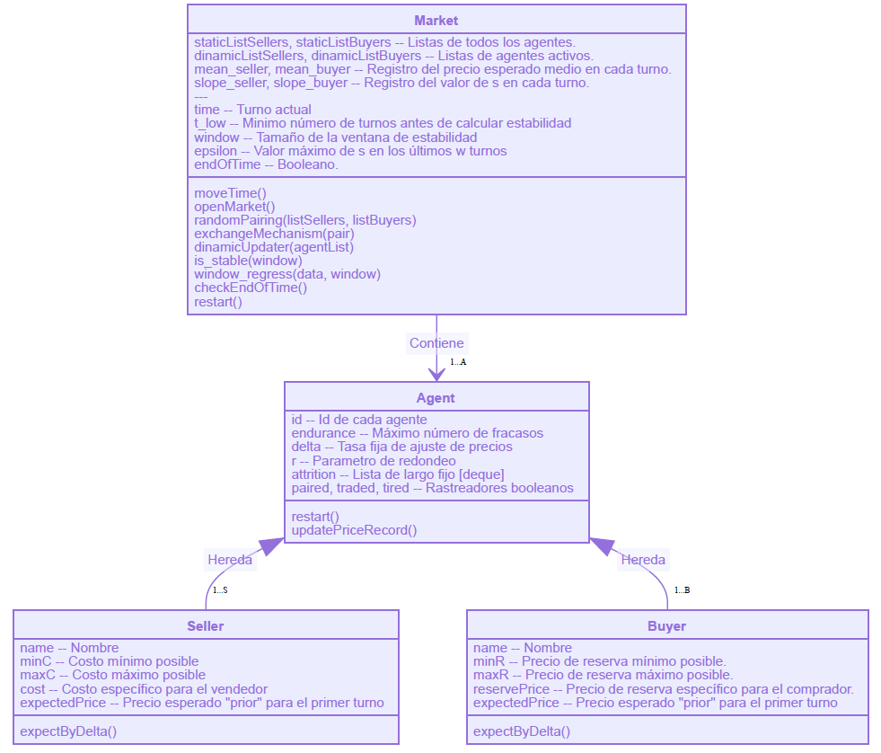
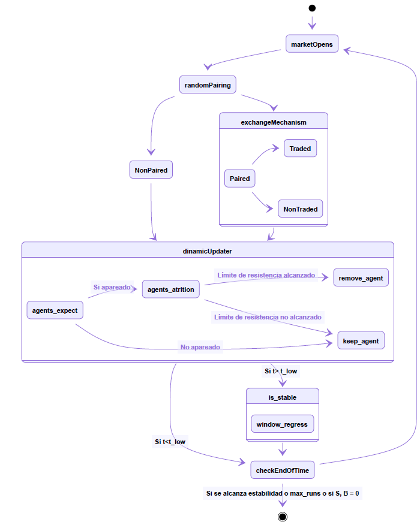
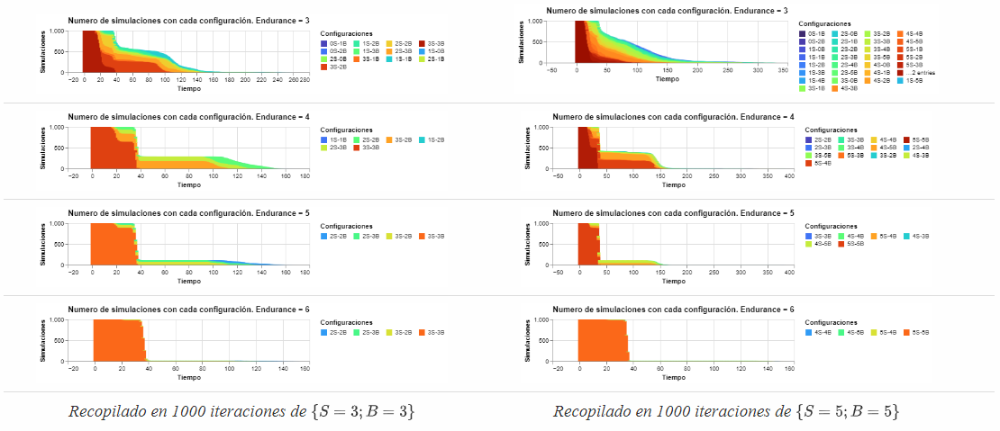
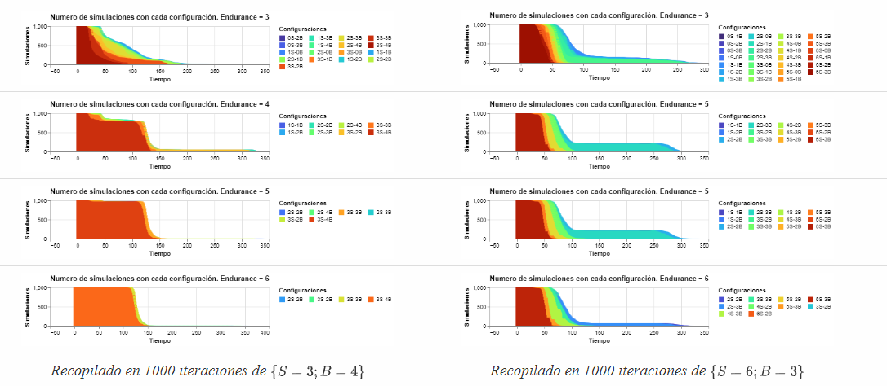
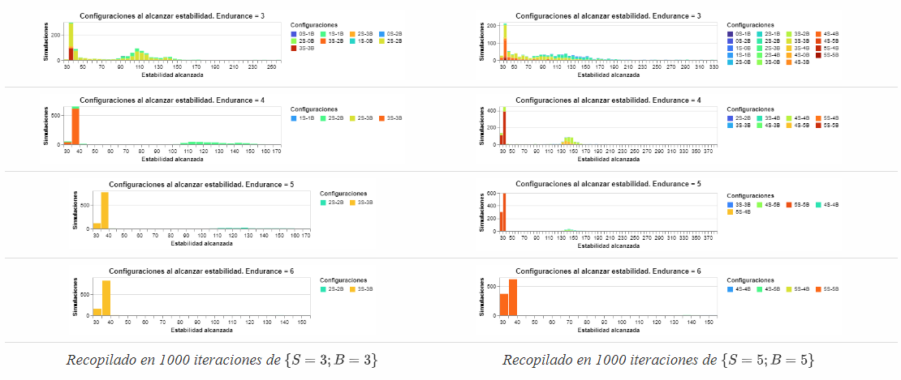
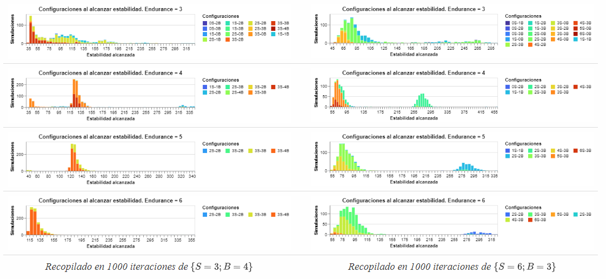

# Ajuste dinámico de precios en un modelo basado en agentes en Python

<h2 style="font-size: 2.5em">Nicolás David Harari</h2>

<h3 style="font-size: 2em">Tutora: Viktoriya Semeshenko</h2>

  

Facultad de Ciencias Económicas - Universidad de Buenos Aires

 <h5 style="font-size: 1.2em"> Segundo Cuatrimestre 2020 </h5>

###  Resumen

Los modelos tradicionales de equilibrio walrasiano presentan una elegante caracterización de los valores de equilibrio que puede tomar una economía dado las características de los agentes ---en este caso las firmas y los consumidores. Sin embargo, un número creciente de autores plantean que este no logra explicitar de forma convincente el mecanismo por el cual los precios llegan a aquellos equilibrios (Arthur, 2015; A. Kirman, 2006; A. P. Kirman & Vriend, 2001). Diversos autores plantean la posibilidad de obtener resultados superadores a los obtenidos mediante las técnicas de modelización tradicional utilizando el paradigma de la economía computacional y técnicas de teoría de la complejidad (Albin y Foley 1992; Arthur 2015; Gode y Sunder 1993; Hommes 2013; Kirman y Vriend 2001; Vriend 1995; Wilhite 2001)

En el siguiente trabajo se considera un modelo simple de mercado donde una población de $n$ vendedores y $m$ compradores heterogéneos deciden si intercambiar o no una única unidad de un bien homogéneo.  El precio de intercambio se actualizará periodo a periodo, conforme los agentes actualizan sus precios esperados para cada periodo. Los resultados presentados al final del trabajo fueron obtenidos utilizando el lenguaje de programación `python`, cuyo código es elaboración personal que se puede encontrar [aquí](https://github.com/ndharari/MarketSimulation). Allí se puede encontrar que el modelo logra replicar el resultado esperado por los modelos de mercado tradicionales: las cantidades relativas de compradores y vendedores cumplen un rol fundamental a la hora de definir el precio de equilibrio emergente. A través de las simulaciones, se encuentra que mientras que todos los agentes en $t_0$ puedan obtener beneficios de intercambio el precio de equilibrio final estará cercano al precio máximo (o mínimo) que está dispuesto a pagar el $|n-m|$ -avo individuo, ordenados por sus disposiciones de mayor a menor (en caso de haber más vendedores que compradores, se presenta el caso contrario) En las oportunidades donde las cantidades son idénticas, el precio de equilibrio es intermedio.

---

## Tabla de contenidos

[TOC]

### Introducción

La idea de que acciones descentralizadas de individuos egoístas logran agregarse en orden sin la necesidad de intermediaciones es la base del concepto de la “mano invisible” del mercado de Smith. Sin embargo, la propia institución del mercado se encuentra desaparecida de los modelos tradicionales de equilibrio walrasiano (Kirman 2006) donde éste no es más que un espacio donde los individuos comunican sus preferencias y sus restricciones presupuestarias y luego son informados del precio de equilibrio y las cantidades a consumir. 

Recientes trabajos resaltan la inverosimilitud del proceso de fijación de precios en el modelo de competencia perfecta clásico. Kirman (2006) sostiene que el proceso de formación de precios, de llegada a los valores de equilibrio se encuentra indeterminado y que incluso la figura del subastador walrasiano no resulta una descripción satisfactoria para muchos mercados. Axtell (2005), por su parte compara la complejidad computacional del proceso de ajuste del subastador walrasiano con un proceso descentralizado. A grandes cantidades de agentes y bienes la complejidad alcanzada por el primer método resulta demasiado alta y, por consiguiente, inverosímil. Una posible alternativa a se puede encontrar en modelos de economía de la complejidad, especialmente en el área de modelos basados en agentes.

Los modelos de economía de la complejidad comparten ciertas características generales: la economía no es necesariamente en equilibrio, los agentes no cuentan con racionalidad perfecta por lo que utilizan múltiples heurísticas y reglas de decisión para encontrar la mejor solución posible en una economía que cambia constantemente de forma orgánica (Arthur 2015). De esta forma un *sistema complejo* puede ser representado con agentes que interactúan entre ellos (Vriend 1995) de forma no muy distinta a los modelos basados en agentes. Este tipo de modelos, según la caracterización de (Dosi y Roventini 2017) no es más que una *población* de agentes que puede (o no) cambiar en el tiempo que evoluciona de forma discreta. Estos agentes están caracterizados por variables y parámetros microeconómicos y determinadas reglas de decisión.

Un error común al analizar modelos económicos basados en agentes es interpretar la simulación como la búsqueda de una representación computacional perfecta del mundo exterior. Como cualquier modelo, un ABM es una representación de un hecho social. Más aun, la única razón por la cual se ejecuta la simulación de un modelo computacional es para realizar los test de consistencia necesarios (Kirman y Vriend 2001). De esta forma, iterar el modelo sobre distintos valores, se puede construir una recopilación de *historias* (Axelrod & Tesfatsion, 2006) que, en el agregado de simulaciones, pueden revelar los hechos estilizados que se busca representar. Esto se vuelve evidente al considerar que los modelos complejos pueden generar resultados inesperados de reglas iniciales simples. Es por esto que, de manera equivalente a que un economista matemático resuelve un sistema de ecuaciones, el investigador de la economía de la complejidad ejecuta el programa y analiza sus resultados: para asegurarse la consistencia de los mismos. 

Múltiples modelos existen en la literatura que intentan resolver el problema del intercambio mediante estrategias basadas en agentes. Heymann et al (2014) proponen una solución al oligopolio de Betrand-Edgeworth donde firmas idénticas deciden el precio de un bien homogéneo mediante reglas simples de actualización de precio basadas en las ventas de los periodos anteriores. Las heurísticas simples logran reproducir satisfactoriamente los resultados de laboratorio. Distintos modelos recopilados en Hommes (2013) también logran replicar resultados de laboratorio en un contexto de mercado competitivo para un bien perecedero cuya demanda debe ser anticipada mediante el uso de distintas heurísticas. Kirman y Vriend (2001) presentan un modelo que mediante la capacidad de los vendedores de discriminar entre distintos compradores y ofertas del tipo “tómalo o déjalo” logra reproducir ciertos hechos estilizados del mercado de pescado de Marsella: una gran dispersión de precio combinada con una alta lealtad de los compradores. 

Sin embargo, no es necesario contar con agentes tan sofisticados: Gode y Sunder (1993) encuentran que sólo es necesario imponer una restricción presupuestaria a agentes con “inteligencia cero” que realizan ofertas aleatorias para obtener resultados cercanos a la eficiencia. Por su parte Vriend (1995) presenta un modelo donde consumidores buscan para conseguir una unidad individual de un bien publicitado por sus vendedores. En este modelo, los agentes saben que existen otros, pero no conocen sus características, sus números o sus acciones cuando se encuentran con otros. Sin embargo, las reglas simples el autor logra responder en sus palabras, *“How do self-organized markets emerge in the economy, and what are their characteristics”*

Finalmente, en su manual introductorio, Hamill y Gilbert (2016) plantean dos modelos de mercado basados en agentes. En el primero, consumidores definidos mediante precios de reserva máximos interactúan con firmas que ajustan tanto su capacidad como los precios de venta de un bien homogéneo. Como también plantea (Kirman 1992) la oferta agregada toma una forma suave aun cuando las firmas individuales son heterogéneas y el modelo logra replicar resultados de competencia perfecta. En el otro caso, utilizado para caracterizar el mercado de productos digitales, las firmas compiten por precio para ganar participación en un contexto de costos bajos, retornos crecientes a escala y sin límites de capacidad. 

---

###  El modelo

Se propone un mercado donde un conjunto fijo de $A$ agentes heterogéneos, entre ellos vendedores $S$ y consumidores $B$ con $A = \{s_1,... s_n; \ b_1, ... b_m\}$, deciden en cada periodo $t$ si intercambiar o no una única unidad de un bien homogéneo. Ambos grupos operan de forma atomizada e independiente por lo que no hay posibilidad de cartelización o acuerdos tanto en la oferta como en la demanda. No se consideran funciones de producción, ganancias, ni riqueza: periodo a periodo los vendedores tendrán bienes a su disposición para vender y consumidores dinero para intercambiar por ellos. Se asume que cada individuo tiene una utilidad de reserva $U$ medida en términos monetarios que representa ---en el caso del vendedor $s_i$--- el costo mínimo $c_i$ por el que está dispuesto a desprenderse del bien en cuestión, mientras que en el caso del comprador $b_j$ el precio máximo idiosincrático $r_j$ dispuesto a pagar por el mismo. Estos valores son elegidos de manera aleatoria para cada jugador de forma que $\forall i, c_i \in \left[\underline{c}, \overline{c}\right]$ y  $\forall j, r_j\in \left[\underline{r}, \overline{r}\right]$, donde $\underline{c}, \overline{c} ; \ \underline{r}, \overline{r}$ son los valores mínimos y máximos posibles. En el contexto del siguiente trabajo, $\overline{c}< \underline{r}$ por lo que para cualquier valor de U los agentes podrían encontrar beneficios de intercambio.

En el inicio del juego, los agentes tienen un *prior* del precio esperado para el primer periodo, $p_{s, 1}, p_{b, 1}$, que representa un valor que creen *justo* por el bien en ese periodo. Este valor no puede ser mayor (o menor) que su utilidad de reserva, porque ningún agente puede pensar que el precio justo de un bien es mayor (menor) al que pagarían (recibirían) por él. Por este motivo, el *prior* individual se obtiene de forma aleatoria siguiendo una distribución uniforme donde $\forall i \  p_{s_i, 1}  \in \left[c_i, \overline{c}\right]$, como también, $\forall j, p_{b_j, 1}\in \left[\underline{r}, r_j\right]$. Esto implica, en el caso del vendedor, que su *prior* estará dentro del intervalo delimitado por el costo máximo posible y su propio costo. 

Al inicio de cada ronda, los jugadores se aproximan al Mercado, el cual los aparea de forma aleatoria hasta agotar el numero de compradores o vendedores. En el caso en el que los conjuntos no tengan el mismo tamaño, habrá $|n-m|$ individuos que quedarán automáticamente fuera de las negociaciones. De esto se infiere fácilmente que para un determinado periodo no puede ocurrir que simultáneamente individuos de ambos conjuntos queden sin pareja.

Una vez de a pares, cada jugador le informa al Mercado su precio de venta propuesto $\{p_{s_i, t};p_{b_j, t}\} $ de acuerdo a cuanto consideran que podrían intercambiar el producto. El Mercado observa los precios y declara una transacción de cumplirse la siguiente condición:
$$
\text{Condición de intercambio en  $t$ entre  $s_i$ y $b_j$} \\
p_{s_i, t}\leq p_{b_j, t}
$$

Acto seguido, se realizará el intercambio. Una vez que todos los pares deciden si realizar o no la transacción, ambas partes se separan y todos los agentes que participaron en el mercado ----agrupados o no---- reevalúan sus expectativas de precios para el siguiente periodo y deciden si continuarán participando en el mismo. El juego continúa hasta que terminen los turnos o hasta que no reste un número positivo de vendedores o consumidores. 

Resulta importante notar que el precio efectivo al que se realiza el intercambio en cada periodo, que de cumplirse la de cumplirse la condición estará en el intervalo $\left[p_{s_i, t} ; p_{b_j, t}\right]$ no resulta relevante, ya que se busca se busca modelar como los agentes reevalúan sus precios esperados periodo a periodo. Otro aspecto central es que la condición de intercambio en $t$ es estáticamente independiente de las utilidades $U$ (costos, precios de reserva) generales de los agentes. Es decir, una vez definidos ambos precios esperados ---cuyas mecánicas de ajuste se explicarán en el siguiente apartado ---como los consumidores no reevalúan sus expectativas hasta el siguiente periodo, si $b_j$ se encuentra frente a un precio tal que $ r_j > p_{s_i, t} > p_{b_j, t} $ no comprará el bien aún cuando su precio es menor que el que estaría dispuesto a pagar, el Mercado no habilita la transacción. Esto ocurre porque el individuo, de aceptar un precio superior a $p_{b_j, t}$ sentiría que **en ese periodo** está siendo engañado y que es posible conseguir el bien por un precio menor. Por lo tanto, el Mercado prohíbe la transacción y este, luego de reevaluar sus expectativas, volverá a buscar una mejor oferta en el periodo siguiente.

#### Ajuste de expectativas

Como se explicó en el apartado anterior, los agentes reevalúan periodo a periodo el precio que creen justo. Se adopta una regla simple para realizar este ajuste: de haber intercambiado en $t$, los agentes consideran el resultado como una señal de que posiblemente no fueron suficientemente duros en sus condiciones; en $t+1$ serán más exigentes. En el caso del vendedor (comprador), esto se traduce en aumentar (disminuir) los precios para el periodo siguiente en una cantidad $\Delta\in [0,1]$. Sin embargo, de no haber resultado exitoso el intercambio (o de no haber logrado conseguir pareja) los agentes retornarán el periodo consecuente menos exigentes: los vendedores (consumidores) bajarán (subirán) su precio esperado. No obstante, debido a que los vendedores tienen un costo $c_i$ debajo del cual no estarán dispuestos a ofrecer su bien y los consumidores un precio de reserva $r_j$ por encima del cual no estarán dispuestos a adquirirlo, la actualización del precio esperado por periodo se definirá de la siguiente manera:

>###### **Ajuste de precios del vendedor**
>
>$$
>\begin{equation}
>p_{s_i, t+1} = \left\{
>\begin{array}{ll}
>p_{s_i, t} +\Delta & {\textrm{si se efectúa el intercambio}} \\
>{\max{\{ p_{s_i, t} -\Delta}; \ c_{i}\}}  & {\textrm{si no se efectúa el intercambio}} \\
>\end{array}\right.
>\end{equation}
>$$
>Donde el precio esperado no puede resultar menor que el costo individual.

>###### Ajuste de precios del comprador
>
>$$
>\begin{equation}
>p_{b_j, t+1} = \left\{
>\begin{array}{ll}
>p_{j_i, t} - \Delta & {\textrm{si se efectúa el intercambio}} \\
>{\min{\{ p_{b_j, t} + \Delta}; \ r_{j}\}}  & {\textrm{si no se efectúa el intercambio}} \\
>\end{array}\right.
>\end{equation}
>$$
>
>Donde el precio esperado no puede resultar mayor al precio de reserva.

Por otro lado, se asume que los individuos mantienen cierta aversión a participar en el mercado y no lograr un intercambio. Sea entonces $ e \in \Z $ un parámetro de la resistencia de los individuos al fracaso, representando el número máximo de turnos consecutivos en los cuales el individuo formó parte de un par y no logró cerrar un intercambio. Este parámetro resulta esencial para asegurar el funcionamiento del modelo. Cuando los pares se forman, los individuos no tienen forma de reconocer a su interlocutor, sólo reciben del Mercado la confirmación - o negación- del intercambio. Suponga el escenario donde existe un vendedor con un costo alto $s_i(\hat{c})$ y el precio esperado del resto de los agentes es menor. Un comprador cualquiera, de encontrarse con $s_i(\hat{c})$ no puede identificar si el rechazo del intercambio ocurre porque el precio que demanda es demasiado exigente *en general* o sólo *en este caso particular*. De no limpiarse el mercado de aquellos consumidores con $U$ prohibitivos, la dinámica de precios esperados se mantiene indefinidamente en valores intermedios y las diferencias de cantidades de compradores y vendedores no se logran generar. De esta condición surge una importante salvedad: el juego terminará o bien al alcanzarse el número máximo de turnos o bien cuando de algún grupo (compradores, vendedores) ya no queden participantes.

En el contexto del siguiente trabajo, tanto $e$ como $\Delta$ resultan parámetros generales del modelo comunes a todos los agentes, tanto consumidores como vendedores. Los costos y precios de reserva marcan la heterogeneidad. En resumen, cada agente tiene tres características individuales que mantienen a lo largo del juego, $U$ ---costo $c_i$ para vendedores y precio de reserva $r_j$ para compradores---, el parámetro de ajuste $\Delta$ por el cual actualizan el precio esperado y la resistencia a la deserción $ e \in \Z $ (*endurance*). Finalmente, cada jugador tiene un precio esperado que considera *"justo"* para cada periodo. 

#### Condiciones Terminales

Hasta ahora se ha expuesto como opera turno a turno el sistema. Sin embargo, no sería práctico que el mismo se expanda indefinidamente en el tiempo: al menos es necesario un A continuación,  se expresarán las condiciones en las cuales el mismo termina. 

La primera restricción temporal del modelo proviene de su misma construcción: periodo a periodo, existe la posibilidad de que cualquiera de los agentes abandone el mercado para no volver. Esto ocurre independientemente de cuántos de sus compañeros continúan en el sistema. Esto implica la posibilidad de que en algún momento no queden compradores o vendedores a participar en el mercado. La primera restricción es que el conjunto de agentes activos de cada tipo para todo momento tenga tamaño positivo. De alcanzar una situación donde no queden compradores o vendedores, acabará el juego. 

La segunda condición terminal responde a la estabilidad del sistema. Como se explicó anteriormente, los agentes periodo a periodo se encuentran con individuos del grupo opuesto, conocen sus precios esperados en ese turno, ignoran las expectativas de aquellos con los que no se ven y reaccionan de forma acorde. Ahora bien, un espectador externo, al preguntarse por el precio del bien en un turno determinado no puede más que describir como están distribuidos los precios esperados de los agentes. Quizás un vendedor particular espera conseguir un precio bajo o un consumidor está dispuesto a pagar un valor elevado, sin embargo los agentes en general consideran que el precio se encuentra *alrededor* de un valor. Esta dinámica proviene del comportamiento de los propios agentes: como se encuentran de a pares de forma aleatoria resulta improbable que las señales que reciban al intercambiar sus precios esperados sean muy distintas a la media de la población. Este fenómeno será específicamente relevante conforme hayan pasado los suficientes turnos para que varios de los agentes se hayan encontrado entre si. 

Por este motivo se propone la siguiente medida de **estabilidad**: periodo a periodo se almacena la información de la media del precio esperado tanto de compradores o vendedores. Con estos datos se busca la tendencia $s$ definida como la pendiente de una regresión lineal de MCO en una ventana de tamaño $w$ para cada grupo. Si durante $w$ periodos seguidos $|s|<\epsilon$, se habrá encontrado estabilidad y se detendrá el modelo. Esta condición estará en efecto una vez pasada una cantidad $T_{low}$ de periodos, que garantiza que se habrán recolectado los datos necesarios para realizar la medida de estabilidad.

Finalmente, para evitar que el sistema continúe sin límite se agrega la ultima condición terminal, una vez alcanzado un numero $T^{Max}$ de turnos. A continuación se expone la implementación del modelo y las dinámicas encontradas. 

---

### Implementación

El presente trabajo utiliza el lenguaje de programación Python para generar las simulaciones del modelo. Este es un lenguaje *open-source* que tiene como foco la legibilidad de su código y la simpleza de sus operativos. Como lenguaje soporta distintos estilos de programación, entre los cuales se encuentra la orientada a objetos (*object oriented programing* o OOP) que es útil para realizar simulaciones basadas en agentes. Esto es porque es posible definir *clases* que funcionan como modelos para inicializar multiplicidad de instancias o realizaciones distintas, *objetos* (Sargent & Stachurski, 2015). Cada objeto cuenta con *atributos* (datos) y *métodos* (funciones) que reflejan una estructura común. Así, es simple proponer una multiplicidad de actores que compartan características similares, pero con diferentes valores particulares. 

Siguiendo esta línea conceptual, se consideran cuatro *clases* dentro de la implementación, el mercado, cuyo rol es el de facilitar el intercambio entre los consumidores--vendedores, ambos tipos distintos de agentes, una clase en sí misma. A continuación se puede observar la estructura del sistema y sus relaciones 

La clase `market` es la principal del modelo: contiene a los agentes, los aparea, obtiene sus precios esperados y les comunica a los agentes si se realiza el intercambio. Luego, almacena la información relativa a los vendedores y compradores medios para los calculos de estabilidad.  Antes de finalizar cada periodo, prepara a los agentes para el periodo posterior, haciendo que estos reevalúen sus expectativas y echa a quienes hayan alcanzado la resistencia máxima. Finalmente, luego de controlar que no se haya alcanzado la condición de estabilidad, que el número de compradores y vendedores sea mayor a cero ---y de no haber alcanzado la cantidad máxima de rondas--- avanza el tiempo. 

Por su parte cada, uno de los distintos `Agent` genera sus parámetros individuales de forma aleatoria. Luego, conforme avanzan los turnos, actualiza y almacena la sucesión de precios esperados. A continuación un diagrama que muestra la secuencia de estados del sistema.

Antes de continuar, es necesario mencionar un parámetro que cumple un rol meramente operacional: `resolution`, el redondeo o resolución del sistema. Al trabajar con realizaciones específicas y como el ajuste esta dado por la suma de un $\Delta$ específico, se decide que todos los valores de costos, precios de reserva y precios esperados pertenecerán al conjunto $\Z/res$ donde, para simplificar aún más, diremos que $res=\frac{1}{\Delta}$. Esta decisión no afecta el resultado de la simulación sino que sirve para facilitar el análisis. 

El código en su totalidad puede encontrarse [aquí](https://github.com/ndharari/MarketSimulation]). Los gráficos presentados a continuación se realizaron utilizando los paquetes `altair` (VanderPlas et al., 2018) y `matplotlib` (Hunter, 2007) mientras que el resto del código es elaboración personal.

---

### Resultados

En el presente apartado se muestran los resultados de las dinámicas de ajuste del modelo para distintas cantidades de compradores y vendedores. Al comienzo de cada simulación estas cantidades se definan y se inicializan los agentes, los cuales se mantendrán idénticos en las $100$ simulaciones. Para facilitar las comparaciones se mantendrán fijos a lo largo de las rondas los intervalos de $U$, la tasa fija de ajuste de precio $\Delta$, la ventana de estabilidad $w$ con su valor máximo $\epsilon$ y los valores mínimos y máximos de turnos. Los valores específicos para las utilidades de reserva y los *prior* del precio esperado para el primer periodo son instanciados con cada agente al comienzo de las rondas y se mantienen a lo largo del proceso. Los parámetros iniciales se presentan en la tabla a continuación. 

|       Comprador       |       Vendedor        | Mercado |
| :-------------------: | :-------------------: | :-----: |
| $\underline{c} = 10$ | $\underline{r} = 20$ | $T_{low}=20 ; T^{max}=500$ |
|   $\overline{c}=20$   |   $\overline{r}=30$   | $N=100$ |
|     $\Delta =0.5$     |    $\Delta =0.50$     | $w=10$ |
|   `resolution` $=2$   |   `resolution` $=2$   | $\epsilon= 0.05$ |

#### Caso simple: un vendedor, dos compradores

Comenzaremos por el caso más simple, en el que un sólo vendedor se encuentra con dos compradores. En los gráficos se muestran los precios esperados de los agentes en cada turno, representados por las líneas de círculos, acompañados de las utilidades de reserva, marcadas con líneas finas horizontales ambas verdes para los vendedores y rojas para los compradores. Al observar el resultado, es posible diferenciar tres etapas distintas en el proceso de ajuste que serán luego compartidas para los casos con mayor número de agentes: **convergencia**, **regateo** y **estabilidad**. 

|  |
| :----------------------------------------------------------: |
| *Gráficos elegidos al azar para valores de $\{S=1; B=2; e=3\}$* |

El periodo de convergencia se encuentra al comenzar la simulación. Recordemos que el precio esperado con el que cada agente comienza es elegido de forma aleatoria, siempre menor a su precio de reserva. Por esto es posible que su precio esperado se encuentre distante del resto de los actores del mercado. En los casos a continuación durante los primeros turnos el precio esperado del vendedor es menor que los de los compradores, por lo que siempre que se encuentra con ellos vende y se vuelve paulatinamente más exigente. En el caso de los compradores, como son más, hay turnos en los que alguno de ellos no se encuentra con un vendedor por lo que su exigencia decae. Por esto, en el segundo gráfico el precio esperado de uno de los vendedores es significativamente menor al otro. En esta parte del proceso, los agentes no suelen abandonar el mercado simplemente porque aún no comenzó la etapa en la que se encuentran con propuestas no atractivas, recordar que se definió $\overline{c}< \underline{r}$ por lo que en el inicio cualquier par de agentes encuentra beneficios de intercambio. 

Ahora bien, cuando los precios esperados de los agentes no garantizan que cualquier par de vendedor-comprador encuentre beneficio en el intercambio, comienza la etapa de regateo. Es aquí donde los agentes se empiezan a encontrar con propuestas que no les son atractivas y que comienzan a rechazar. A medida que avanzan los turnos, es posible que alguno se enfrente de forma consecutiva con $e$ oportunidades frustradas y que abandone el mercado. Esto puede suceder cuando el precio promedio del mercado supera su utilidad de reserva, pero no es necesario que sea en esas circunstancias. Es útil recordar que la condición para que un agente abandone el mercado no responde de forma directa a su precio individual de reserva, o incluso al valor de su precio esperado, sino a la coincidencia de encontrarse de forma consecutiva en un numero de fracasos al intercambiar con sus pares. La seguidilla de encuentros fallidos ----aquellos donde el precio ofrecido por el vendedor es mayor al del comprador--- puede ocurrir en cualquier momento, sea prohibitivo el precio de mercado o no ya que depende del azar de los encuentros. De esta forma es posible que un agente que *debería* quedarse en el juego según sus utilidades de reserva abandone al encontrarse aleatoriamente en una seguidilla de encuentros desventajosos. Respecto a este fenómeno se hará mayor hincapié en la secciones siguientes, especialmente cuando se discuta el parámetro de estabilidad.

Es así como los agentes van reevaluando sus expectativas (y abandonando el sistema) de acuerdo a quienes se encuentran periodo a periodo. Eventualmente, éstas tienen un cambio menor a lo largo del modelo, de forma que la media para ambos grupos se mantiene constante durante al menos, $w$ periodos. En este contexto, decimos que se alcanzó estabilidad. Esta condición suele suceder, como se mostrará más adelante, cuando la cantidad de compradores y vendedores es igual.

Sin embargo, aun no se ha explicado el interrogante central del modelo: por qué el precio tiende a subir cuando hay mayor cantidad de compradores. La respuesta es simple cuando uno recuerda dos factores; el primero que al ser parte del grupo más pequeño el vendedor participa todos los periodos del mercado, mientras que sus contrincantes sólo lo hacen *en promedio* turno por medio. De forma que, de encontrarse con propuestas atractivas el vendedor va a volverse más exigente periodo a periodo. Y esto ocurrirá por el segundo factor: los compradores se vuelven menos exigentes si vuelven a su casa con las manos vacías *independientemente de haberse encontrado con el vendedor*. Es posible asegurar que no importar el resultado del regateo **al menos un individuo** (generalizando $B-S$ si $S>B$) **aumentará su precio esperado para el periodo subsiguiente**. Estos dos factores interconectados son los que generan en definitiva el aumento del precio en el sistema.

No obstante las dinámicas individuales, la aleatoriedad en el apareamiento de compradores y vendedores sugiere la necesidad de analizar los resultados agregados a través de las $N$ instancias, todas con agentes idénticos. A continuación se presentan dos gráficas posibles: un gráfico estilo Heymann et al (2014) donde se muestra el precio mínimo, máximo y promedio de uno de los grupos (en este caso, compradores) junto con una instanciación particular de muestra y el gráfico de medias vs medias en cada periodo a lo largo de las simulaciones, ambos acompañados con histogramas que muestran el número de simulaciones que alcanzan estabilidad en cada turno. 

En el primer gráfico se puede apreciar que el precio máximo nunca supera el precio de reserva más elevado del mercado (ya que nadie espera un precio mayor al propio de reserva) mientras que una vez la mayor parte de las simulaciones comienza a alcanzar estabilidad el precio mínimo iguala o supera el  menor precio de reserva, lo que significa que es éste quien termina abandonando el mercado. En estos turnos, la media de los compradores supera este valor mínimo, estabilizándose en puntos apenas superiores. Es importante recordar que a medida que las simulaciones finalizan, su media no es contabilizada en la media total, lo que explica la característica zigzageante una vez superado el turno 90: en este momento, sólo queda una simulación por mostrar. 

En el gráfico de la derecha puede apreciarse el motivo por el cual se considera como medida de estabilidad la media de los precios esperados: tanto a través de las simulaciones como en cada simulación individual los agentes parecen "seguir" la media del grupo contrario, marcando de esta forma los momentos generales de convergencia, regateo (aquellos puntos donde se mantienen muy próximas las curvas) y convergencia. Esto tiene una explicación bastante intuitiva: cada agente recibe información de un contrincante por vez sin saber si se trata de un nuevo individuo o no y su reacción responde a si la nueva propuesta es mejor (o peor) a las vistas anteriormente, o mejor dicho, a la recalibración de las expectativas dadas las propuestas previas. De esta forma el mercado se mueve alrededor de los valores medios, reaccionando a las posibilidades de cambio de los precios que perciban los agentes

|  |
| :----------------------------------------------------------: |
|   *Gráficos agregados para valores de $\{S=1; B=2; e=3\}$*   |

#### Simulaciones con más agentes: casos individuales y agregados

El caso presentado en el apartado anterior resulta ilustrador de como funcionan las dinámicas de ajuste en circunstancias simples con pocos agentes. Sin embargo, no es necesario aumentar enormemente el número de $\{S, B\}$ individuos iniciales para que el sistema se torne más complejo; note que el número de configuraciones finales distintas posibles es de $(S+1)\times (B+1)$ individuos (considerando que pueden abandonar todos los de un tipo), sin considerar la posibilidad de precios medios finales mayores o menores. Sin embargo, es posible encontrar que la cantidades relativa inicial de compradores y vendedores cumple un rol fundamental a la hora de definir el precio de equilibrio emergente y es por esto que el presente apartado se divide en tres secciones, una donde las cantidades son idénticas, otra donde se encuentra prevalencia de vendedores y una tercera con mayoría compradores. El análisis de las dinámicas agregadas a través de las simulaciones se reserva para apartados posteriores.

<h5 style="margin-bottom:0;">Igual cantidad de compradores y vendedores</h5>
<h6 style="margin-top:0;">El precio medio suele permanecer en valores intermedios</h6>

El primer caso a considerar es cuando las cantidades de compradores y vendedores son iguales. A continuación vemos dos realizaciones particulares de una simulación de $\{S=3; B=3;e=4\}$ elegidas intencionalmente para mostrar los resultados posibles. A la izquierda se encuentra el ejemplo más común ($89$ de las $100$ simulaciones se comportaron de esta manera) donde ambos grupos superaron la etapa de regateo sin perder camaradas. Así, ningún grupo participa en promedio más veces del mercado o tiene individuos que consistentemente vuelven luego de no encontrar pareja menos exigentes el turno siguiente. La etapa de regateo termina con todos los participantes con precios esperados similares alcanzando estabilidad apenas pasados 30 periodos. 

Ahora bien, en el segundo caso ocurre algo particular: en algún momento de la etapa de regateo un vendedor abandona el mercado. El motivo es el azar, durante $e$ periodos consecutivos se encontró con propuestas no atractivas y decidió abandonar el juego. De esta forma el sistema tiene un desbalance, un mayor número de compradores implica que periodo a periodo uno de ellos no encontrará pareja y retornando menos exigente, haciendo subir el precio esperado promedio hasta que uno abandone el mercado y este encuentre estabilidad.

|  |
| :----------------------------------------------------------: |
| *Gráficos ilustrativos para valores de $\{S=3; B=3; e=4\}$*  |

No obstante, si se realiza una simulación con más agentes, como en el ejemplo a continuación $\{S=5; B=5; e=4\}$, hay mayores posibilidades de que algún individuo abandone sorpresivamente el mercado. Aún así, la mayor parte de las simulaciones ($56/100$) terminan como en primer gráfico: en pocos turnos en valores intermedios. Sin embargo un porcentaje importante se toma más turnos para alcanzar la estabilidad, debido a que en algún momento alguno de los agentes cumplió su condición de resistencia y abandonó el mercado. El segundo gráfico muestra uno de estas simulaciones, esta vez mostrando el caso donde inicialmente dos compradores abandonan el mercado llevando el precio esperado hacia abajo. Naturalmente, esta dinámica resulta más lenta de llegar a la estabilidad. 

Aun así, la tercera gráfica muestra una posibilidad poco probable (sólo ocurre una vez) pero que resalta la aleatoriedad detrás del abandono del mercado en el modelo: el desfasaje de individuos no ocurre una vez si no dos. La primera vez al inicio del sistema vendedores abandonan el mercado generando un impulso al aumento del precio esperado promedio. Sin embargo, no se llega al equilibrio en valores elevados, si no que alrededor del turno $200$ las cantidades relativas de agentes se invierten: ahora es el comprador quien tiene la ventaja. El precio desciende a lo largo de los turnos restantes para alcanzar equilibrio en un precio esperado alrededor de $20$.

|  |
| :----------------------------------------------------------: |
| *Gráficos ilustrativos para valores de $\{S=5; B=5; e=4\}$*  |

A continuación se presenta una forma simple de evidenciar el comportamiento del sistema, esta vez agregando las $N$ distintas realizaciones. Los gráficos muestran tanto para cada grupo la media de los precios esperados *dentro* de cada simulación y *entre* las simulaciones acompañados de un histograma del momento turno donde fue alcanzada la estabilidad.  De esta forma se puede apreciar ciertos puntos. En primer lugar, en ambas simulaciones la mayoría de los casos concluye relativamente rápido, de forma que en los periodos iniciales la media dentro y entre para ambos grupos se mantiene en valores intermedios. No obstante, también se puede apreciar que algunas simulaciones no responden a esta dinámica y representan los casos antes mencionados. En el caso de la derecha, la realización con el doble desfasaje de individuos domina los últimos $200$ turnos de la simulación, de forma que ambas medias son idénticas (porque sólo resta una simulación por terminar).

|  |  |
| :----------------------------------------------------------: | ------------------------------------------------------------ |
|  |  |
|   *Gráficos agregados para valores de \${S=3; B=3; e=4\}$*   | *Gráficos agregados para valores de $\{S=5; B=5; e=4\}$*     |

<h5 style="margin-bottom:0;">Mayor cantidad de compradores</h5>
<h6 style="margin-top:0;">El precio medio suele subir</h6>

A continuación analizaremos el resultado de una superioridad numérica de compradores. Se presentan las dinámicas resultantes de simulaciones realizadas con $\{S=3; B=4; e=4\}$. A la izquierda se ve el resultado esperado (y más común), la existencia de un comprador adicional que retorna periodo a periodo menos exigente fuerza el precio medio a subir y lleva al sistema a un equilibrio con un precio elevado.

El caso de la derecha resulta particular: de forma azarosa, algún comprador abandona el mercado en el comienzo de la etapa de regateo.  De esta forma, al no existir más el desbalance de cantidades, el resultado final es similar al analizado en el apartado anterior, con precio final intermedio y estabilidad temprana.

|  |
| :----------------------------------------------------------: |
| *Gráficos ilustrativos para valores de $\{S=3; B=4; e=4\}$*  |

Para mostrar el comportamiento agregado en esta sección complementaremos la gráfica *dentro-entre* (a la izquierda) con el recorrido de un vendedor al azar a lo largo de las distintas simulaciones acompañado por su media general. A primera vista resalta la similitud de ambos gráficos: el comportamiento de cada uno de los individuos sigue de cerca al comportamiento general en su mayoría de la forma esperada, más compradores subir el precio. De aquellas simulaciones que alcanzan un precio mayor algunas terminan con precios mayores, estables al superar una segunda utilidad de reserva. Esto resulta de la pérdida de otro vendedor adicional, logrando un equilibrio con precio aún mayor. Respecto de las configuraciones posibles al terminar las simulaciones se profundizará en el siguiente apartado.

También es posible que ocurran dos resultados particulares: unos $11$ casos terminan prematuramente (como se muestra en el ejemplo anterior) debido a que algún comprador abandona el mercado y el precio resulta intermedio. ¿Qué ocurre entonces si dos compradores abandonan el mercado al comienzo de la situación? Bueno, se espera ver el resultado donde el precio cae, hasta alcanzar estabilidad en valores menores. Respecto a este tipo de dinámicas se discutirá a continuación.

|   |
| :----------------------------------------------------------: |
|    *Gráficos agregados para valores de \{S=3; B=4; e=4\}*    |

<h5 style="margin-bottom:0;">Mayor cantidad de vendedores</h5>
<h6 style="margin-top:0;">El precio medio suele bajar</h6>

Finalmente queda por exponer la última variante, cuando hay una mayor variedad de vendedores: en esta oportunidad se presentan dos instanciaciones del caso de $\{S=6; B=3; e=4\}$. Ahora, será la mitad de los vendedores que retornan periodo a periodo menos exigentes debido que no encuentran pareja. Esto genera que el precio medio caiga de forma más acelerada al principio y a medida que los vendedores son desplazados del mercado 

|  |
| :----------------------------------------------------------: |
| *Gráficos ilustrativos para valores de $\{S=6; B=3; e=4\}$*  |

En este caso los gráficos *dentro-entre* muestran un comportamiento bastante unificado: todos las simulaciones terminan de la forma esperada, con el precio medio del sistema para ambos grupos en valores bajos. Una posible explicación de esta consistencia resulta del gran desbalance de cantidades, que no sólo acelera la convergencia resultante como se explica arriba, sino también porque si la diferencia entre ambos grupos es especialmente elevada la probabilidad de que abandonen de forma azarosa el numero indicado de compradores como para dar vuelta las cantidades relativas es menor comparada con los casos anteriores.

|  |
| :----------------------------------------------------------: |
|    *Gráficos agregados para valores de \{S=6; B=3; e=4\}*    |

De esta forma, en los tres apartados que preceden se mostraron los resultados buscados en la construcción del modelo: la cantidad relativa inicial de agentes determina en la gran mayoría como varía el precio esperado de los agentes. En resumidas cuentas: a igual cantidad de compradores y vendedores el precio medio suele permanecer en valores intermedios, mientras que si hay mayor cantidad de compradores el precio medio suele subir y si hay mayor cantidad de vendedores el precio medio suele bajar.

#### El rol de la resistencia

Como se explicó en [esta](#Ajuste de Expectativas) sección, el parámetro $e$ de resistencia es fundamental para que el sistema logre encontrar equilibrios en valores no intermedios, al *limpiar* al mercado de aquellos agentes con utilidades de reserva prohibitivas. Esto resultaba necesario porque los participantes no reciben mayor información que el precio propuesto por su contrincante y no los puede diferenciar entre ellos. Para que cumpla su función entonces $e$ debe ser suficientemente chico: de no serlo, aquellos individuos superfluos se mantendrían en el sistema de forma que o tardaría muchos turnos terminar o jamás ajustaría el sistema.

Sin embargo, este parámetro tiene asociada una consecuencia no menor. Como se explicitó [anteriormente,](#Simulaciones con más agentes: casos individuales y agregados) no existe mecanismo que garantice que los únicos agentes que abandonen el mercado sean aquellos con valores de $U$ prohibitivos, de forma que es posible que un individuo sólo haya tenido la *mala suerte* de encontrarse $e$ veces seguidas con malas propuestas que lo forzaron a abandonar el mercado.  Esto puede ocurrir aún cuando su propuesta podría ---en el final de la simulación--- ser competitiva. Este resultado negativo es cada vez más probable conforme más pequeño es el parámetro. Existe entonces la dificultad de determinar el valor apropiado para la variable de resistencia. Muy elevado y no cumple su función y muy pequeño y el sistema no encuentra equilibrios satisfactorios. 

Para evidenciar este efecto se realizó una segunda ronda de simulaciones. Para cada una de las cantidades iniciales de casos *$\{S=3; B=3\}, \{S=5; B=5\}, \{S=6; B=3\}, \{S=4; B=3\}$* se inicializaron los agentes con los mismos parámetros que en el ejercicio anterior. En cada caso, se realizaron $1000$ simulaciones para cada cada uno de los siguientes valores de $e\in \{3,4,5,6\}$ recopilando las configuraciones de vendedores y compradores activas en cada momento y el turno en el que se alcanza la estabilidad. 

Comenzaremos por mostrar el número de simulaciones activas que por configuración de vendedores-compradores en cada turno. En un primer momento podemos evidenciar que todos los casos mantienen sus cantidades iniciales en la etapa inicial de convergencia. Luego, la posibilidad de abandonar el sistema y la resistencia entran en juego. Es de esta forma que en los periodos subsiguientes empiezan que mantienen esa configuración inicial son menores, ya sea porque alcanzaron estabilidad (el caso más común cuando $S=B$)  o porque algún participante abandonó el sistema (más común cuando $S\neq B $. De cualquier forma, es evidente que a mayores valores de $e$ menor es la fragmentación en distintos grupos y se logra un resultado más cohesivo, especialmente cuando el número inicial de agentes es grande. Nuevamente, el número de configuraciones finales distintas posibles es de $(S+1)\times (B+1)$ individuos. Y cuando los valores de $e$ son bajos, más configuraciones totales aparecen, aún cuando (como se verá también más adelante) la mayor parte de ellas lo hace de la forma esperada.

También es posible analizar los resultados según el momento en el que alcanzan una situación de estabilidad. En este caso, es simple ver como no sólo el aumento de la resistencia influye en disminuir el número de configuraciones finales, si no también que aquellas configuraciones similares concluyen por "momentos". Por ejemplo, en el caso $\{S=5; B=5, e=4\}$ es bien claro que aquellos que encuentran equilibrio $\{S=5; B=5\}$ finalizan entre los turnos $30-50$ mientras que aquellos donde un participante abandona sorpresivamente el mercado se llega a la estabilidad alrededor del turno $140$. Más allá de los factores particulares y de los resultados atípicos (los cuales disminuyen con el aumento de $e$) la proporción más grande de casos finaliza temprano y de la forma esperada.

En el caso de las situaciones donde el número inicial de cada grupo es distinto la dinámica no resulta muy distinta a la ya descripta. Igualmente, ciertas diferencias se pueden encontrar. Por un lado, como se explicó en el apartado anterior, existe la posibilidad (especialmente en el caso $\{S=3; B=4\})$ que azarosamente un individuo abandone el proceso y que el sistema encuentre equilibrio en precios intermedios, como se puede ver para el caso $e=4$. 

Ahora bien, en ambos casos y especialmente para los valores más grandes de $e$ ocurre que se alcanza estabilidad sin haber logrado reducir el número de agentes hasta que se igualen en ambos grupos. Esto no necesariamente implica que la dinámica no genera ajuste; recordar que la condición terminal no considera el número de agentes en el sistema, sólo el comportamiento de la media de los precios esperados para cada grupo a lo largo del tiempo. Especialmente en situaciones donde los agentes tienen precios de reserva cercanos puede suceder que la variación de las expectativas del resto de los agentes no sea lo suficientemente grande como para no activar la condición de estabilidad. Sin embargo, este resultado no invalida de ninguna manera el objetivo del modelo, que en definitiva encuentra efectivamente que el precio final en la mayoría de los casos es cercano al la utilidad de reserva del $|n-m|$ -avo individuo

---

### Conclusiones

Lorem ipsum dolor sit amet, consectetur adipiscing elit. Suspendisse quis erat sem. Praesent lobortis id metus at sollicitudin. Aliquam fringilla vulputate mauris a posuere. Nulla porta sem vel lacus fermentum, id dapibus magna fermentum. Nullam at ex vel ex congue blandit. Integer tempus mi neque. In hac habitasse platea dictumst. Vestibulum at nunc eros. Donec consequat ornare risus, eu faucibus nulla tincidunt ac. Vivamus pulvinar nisl a sollicitudin malesuada. Nulla facilisis nisl non lorem facilisis, in ultrices dolor efficitur. Aliquam eleifend id lorem sit amet faucibus. Curabitur eget lectus in nunc interdum semper non sed nisl. Ut rutrum tristique massa ac tempus.

Lorem ipsum dolor sit amet, consectetur adipiscing elit. Suspendisse quis erat sem. Praesent lobortis id metus at sollicitudin. Aliquam fringilla vulputate mauris a posuere. Nulla porta sem vel lacus fermentum, id dapibus magna fermentum. Nullam at ex vel ex congue blandit. Integer tempus mi neque. In hac habitasse platea dictumst. Vestibulum at nunc eros. Donec consequat ornare risus, eu faucibus nulla tincidunt ac. Vivamus pulvinar nisl a sollicitudin malesuada. Nulla facilisis nisl non lorem facilisis, in ultrices dolor efficitur. Aliquam eleifend id lorem sit amet faucibus. Curabitur eget lectus in nunc interdum semper non sed nisl. Ut rutrum tristique massa ac tempus.

---

### Bibliografía

Albin, P., & Foley, D. K. (1992). Decentralized, dispersed exchange without an auctioneer. *Journal of Economic Behavior & Organization*, *18*(1), 27-51. https://doi.org/10.1016/0167-2681(92)90051-C

Arthur, W. B. (2015). *Complexity and the economy*. Oxford University Press.

Axelrod, R. (2005). Advancing the Art of Simulation in the Social Sciences. En *Handbook of Research on Nature Inspired Computing for Economy and Management* (Idea Group, p. 13).

Axelrod, R., & Tesfatsion, L. (2006). A guide for newcomers to agent-based modeling in the social sciences. En *Handbook of Computational Economics, Vol. 2: Agent-Based Computational Economics* (p. 13). Elsevier, North-Holland.

Axtell, R. (2005). The Complexity of Exchange. *The Economic Journal*, *115*(504), 193-210. https://doi.org/10.1111/j.1468-0297.2005.01001.x

Chisari, O. O., Cicowiez, M., Escudé, G. J., Heymann, D., Kawamura, E., Perazzo, R., Romero, C. A., & Zimmermann, M. (s. f.). *Progresos en economía computacional* (1era ed.). Temas Grupo Editorial.

Cimoli, M., Pereima, J. B., & Porcile, G. (2016). Introduction to the special issue SCED: Complexity and economic development. *Structural Change and Economic Dynamics*, *38*, 1-2. https://doi.org/10.1016/j.strueco.2016.04.004

Dosi, G., Fagiolo, G., & Roventini, A. (2008). The microfoundations of business cycles: An evolutionary, multi-agent model. *Journal of Evolutionary Economics*, *18*, 413–432. https://doi.org/10.1007/s00191-008-0094-8

Dosi, G., & Roventini, A. (2017). Agent-Based Macroeconomics and Classical Political Economy: Some Italian Roots. *Italian Economic Journal*, *3*(3), 261-283. https://doi.org/10.1007/s40797-017-0065-z

Gode, D. K., & Sunder, S. (1993). Allocative Efficiency of Markets with Zero-Intelligence Traders: Market as a Partial Substitute for Individual Rationality. *Journal of Political Economy*, *101*(1), 119-137. https://doi.org/10.1086/261868

Gordon, M. B., Nadal, J.-P., Phan, D., & Semeshenko, V. (2004). *How to choose under social influence?* 11.

Hamill, L., & Gilbert, N. (2016). *Agent-Based Modelling in Economics*. Wiley.

Heymann, D., Kawamura, E., Perazzo, R., & Zimmermann, M. G. (2014). Behavioral heuristics and market patterns in a Bertrand–Edgeworth game. *Journal of Economic Behavior & Organization*, *105*, 124-139. https://doi.org/10.1016/j.jebo.2014.04.027

Heymann, D., Perazzo, R. P. J., & Schuschny, A. R. (2004). Learning and imitation: Transitional dynamics in variants of the bam. *Advances in Complex Systems*, *07*(01), 21-38. https://doi.org/10.1142/S0219525904000020

Hommes, C. (2013). *Behavioral Rationality and Heterogeneous Expectations in Complex Economic Systems*. Cambridge University Press. https://doi.org/10.1017/CBO9781139094276

Hunter, J. D. (2007). Matplotlib: A 2D graphics environment. *Computing in Science & Engineering*, *9*(3), 90–95. https://doi.org/10.1109/MCSE.2007.55

Kirman, A. (2006). Demand Theory and General Equilibrium: From Explanation to Introspection, a Journey down the Wrong Road. *History of Political Economy*, *38*(Suppl 1), 246-280. https://doi.org/10.1215/00182702-2005-025

Kirman, A. P. (1992). Whom or What Does the Representative Individual Represent? *The Journal of Economic Perspectives*, *6*(2), 117-136.

Kirman, A. P., & Vriend, N. J. (2001). Evolving market structure: An ACE model of price dispersion and loyalty. *Journal of Economic Dynamics & Control*, 459-502.

Schelling, T. C. (1978). *Micromotives and macrobehavior* (1st ed). Norton.

Semeshenko, V., Gordon, M. B., & Nadal, J.-P. (2008). Collective states in social systems with interacting learning agents. *Physica A: Statistical Mechanics and Its Applications*, *387*(19-20), 4903-4916. https://doi.org/10.1016/j.physa.2008.04.019

team, T. pandas development. (2020). *pandas-dev/pandas: Pandas* (latest) [Computer software]. Zenodo. https://doi.org/10.5281/zenodo.3509134

Tesfatsion, L., & Judd, K. L. (Eds.). (2006). *Agent-based computational economics* (1. ed). Elsevier, North-Holland.

VanderPlas, J., Granger, B., Heer, J., Moritz, D., Wongsuphasawat, K., Satyanarayan, A., Lees, E., Timofeev, I., Welsh, B., & Sievert, S. (2018). Altair: Interactive Statistical Visualizations for Python. *Journal of Open Source Software*, *3*(32), 1057. https://doi.org/10.21105/joss.01057

Vriend, N. J. (1995). Self-organization of markets: An example of a computational approach. *Computational Economics*, *8*(3), 205-231. https://doi.org/10.1007/BF01298460

Wilhite, A. (2001). Bilateral Trade and ‘Small-World’ Networks. *Computational Economics*, *18*, 49-64.

---

### Anexo

##### Gráficos animados de resistencia

|  |  |
| ------------------------------------------------------------ | ------------------------------------------------------------ |
|  |  |
|  |  |
|  |  |