# Ajuste dinámico de precios en un modelo basado en agentes en Python

<h2 style="font-size: 2.5em">Nicolás David Harari</h2>

<h3 style="font-size: 2em">Tutora: Viktoriya Semeshenko</h2>

  

Facultad de Ciencias Económicas - Universidad de Buenos Aires

 <h5 style="font-size: 1.2em"> Primer Cuatrimestre 2020 </h5>

###  Resumen

Los modelos tradicionales de equilibrio walrasiano presentan una elegante caracterización de los valores de equilibrio que puede tomar una economía dado las características de los agentes ---en este caso las firmas y los consumidores. Sin embargo, un número creciente de autores plantean que este no logra explicitar de forma convincente el mecanismo por el cual los precios llegan a aquellos equilibrios (Arthur, 2015; A. Kirman, 2006; A. P. Kirman & Vriend, 2001). Diversos autores plantean la posibilidad de obtener resultados superadores a los obtenidos mediante las técnicas de modelización tradicional utilizando el paradigma de la economía computacional y técnicas de teoría de la complejidad (Albin y Foley 1992; Arthur 2015; Gode y Sunder 1993; Hommes 2013; Kirman y Vriend 2001; Vriend 1995; Wilhite 2001)

En el siguiente trabajo se considera un modelo simple de mercado donde una población de $n$ vendedores y $m$ compradores heterogéneos deciden si intercambiar o no una única unidad de un bien homogéneo.  El precio de intercambio se actualizará periodo a periodo, conforme los agentes actualizan sus precios esperados para cada periodo. Los resultados presentados al final del trabajo fueron obtenidos utilizando el lenguaje de programación `python`, cuyo código es elaboración personal que se puede encontrar [aquí](https://github.com/ndharari/MarketSimulation). Allí se puede encontrar que el modelo logra replicar el resultado esperado por los modelos de mercado tradicionales: las cantidades relativas de compradores y vendedores cumplen un rol fundamental a la hora de definir el precio de equilibrio emergente. A través de las simulaciones, se encuentra que mientras que todos los agentes en $t_0$ puedan obtener beneficios de intercambio el precio de equilibrio final estará cercano al precio máximo (o mínimo) que está dispuesto a pagar el $|n-m|$ -avo individuo, ordenados por sus disposiciones de mayor a menor (en caso de haber más vendedores que compradores, se presenta el caso contrario) En las oportunidades donde las cantidades son idénticas, el precio de equilibrio es intermedio.

---

## Tabla de contenidos

[TOC]

### Introducción

La idea de que acciones descentralizadas de individuos egoístas logran agregarse en orden sin la necesidad de intermediaciones es la base del concepto de la “mano invisible” del mercado de Smith. Sin embargo, la propia institución del mercado se encuentra desaparecida de los modelos tradicionales de equilibrio walrasiano (Kirman 2006) donde éste no es más que un espacio donde los individuos comunican sus preferencias y sus restricciones presupuestarias y luego son informados del precio de equilibrio y las cantidades a consumir. 

Recientes trabajos resaltan la inverosimilitud del proceso de fijación de precios en el modelo de competencia perfecta clásico. Kirman (2006) sostiene que el proceso de formación de precios, de llegada a los valores de equilibrio se encuentra indeterminado y que incluso la figura del subastador walrasiano no resulta una descripción satisfactoria para muchos mercados. Axtell (2005), por su parte compara la complejidad computacional del proceso de ajuste del subastador Walrasiano con un proceso descentralizado. A grandes cantidades de agentes y bienes la complejidad alcanzada por el primer método resulta demasiado alta y, por consiguiente, inverosímil. Una posible alternativa a se puede encontrar en modelos de economía de la complejidad, especialmente en el área de modelos basados en agentes.

Los modelos de economía de la complejidad comparten ciertas características generales: la economía no es necesariamente en equilibrio, los agentes no cuentan con racionalidad perfecta por lo que utilizan múltiples heurísticas y reglas de decisión para encontrar la mejor solución posible en una economía que cambia constantemente de forma orgánica  (Arthur 2015). De esta forma un *sistema complejo* puede ser representado con agentes que interactúan entre ellos (Vriend 1995) de forma no muy distinta a los modelos basados en agentes. Este tipo de modelos, según la caracterización de (Dosi y Roventini 2017) no es más que una *población* de agentes que puede (o no) cambiar en el tiempo que evoluciona de forma discreta. Estos agentes están caracterizados por variables y parámetros microeconómicos y determinadas reglas de decisión.

Un error común al analizar modelos económicos basados en agentes es interpretar la simulación como la búsqueda de una representación computacional perfecta del mundo exterior. Como cualquier modelo, un ABM es una representación de un hecho social. Más aun, la única razón por la cual se ejecuta la simulación de un modelo computacional es para realizar los test de consistencia necesarios (Kirman y Vriend 2001). De esta forma, iterar el modelo sobre distintos valores, se puede construir una recopilación de *historias* (Axelrod & Tesfatsion, 2006) que, en el agregado de simulaciones, pueden revelar los hechos estilizados que se busca representar. Esto se vuelve evidente al considerar que los modelos complejos pueden generar resultados inesperados de reglas iniciales simples. Es por esto que, de manera equivalente a que un economista matemático resuelve un sistema de ecuaciones, el investigador de la economía de la complejidad ejecuta el programa y analiza sus resultados: para asegurarse la consistencia de los mismos. 

Múltiples modelos existen en la literatura que intentan resolver el problema del intercambio mediante estrategias basadas en agentes. Heymann et al (2014) proponen una solución al oligopolio de Betrand-Edgeworth donde firmas idénticas deciden el precio de un bien homogéneo mediante reglas simples de actualización de precio basadas en las ventas de los periodos anteriores. Las heurísticas simples logran reproducir satisfactoriamente los resultados de laboratorio. Distintos modelos recopilados en Hommes (2013) también logran replicar resultados de laboratorio en un contexto de mercado competitivo para un bien perecedero cuya demanda debe ser anticipada mediante el uso de distintas heurísticas. Kirman y Vriend (2001) presentan un modelo que mediante la capacidad de los vendedores de discriminar entre distintos compradores y ofertas del tipo “tómalo o déjalo” logra reproducir ciertos hechos estilizados del mercado de pescado de Marsella: una gran dispersión de precio combinada con una alta lealtad de los compradores. 

Sin embargo, no es necesario contar con agentes tan sofisticados: Gode y Sunder (1993) encuentran que sólo es necesario imponer una restricción presupuestaria a agentes con “inteligencia cero” que realizan ofertas aleatorias para obtener resultados cercanos a la eficiencia. Por su parte Vriend (1995) presenta un modelo donde consumidores buscan para conseguir una unidad individual de un bien publicitado por sus vendedores. En este modelo, los agentes saben que existen otros, pero no conocen sus características, sus números o sus acciones cuando se encuentran con otros. Sin embargo, las reglas simples el autor logra responder en sus palabras, *“How do self-organized markets emerge in the economy, and what are their characteristics”*

Finalmente, en su manual introductorio, Hamill y Gilbert (2016) plantean dos modelos de mercado basados en agentes. En el primero, consumidores definidos mediante precios de reserva máximos interactúan con firmas que ajustan tanto su capacidad como los precios de venta de un bien homogéneo. Como también plantea (Kirman 1992) la oferta agregada toma una forma suave aun cuando las firmas individuales son heterogéneas y el modelo logra replicar resultados de competencia perfecta. En el otro caso, utilizado para caracterizar el mercado de productos digitales, las firmas compiten por precio para ganar participación en un contexto de costos bajos, retornos crecientes a escala y sin límites de capacidad. 

##### Modelos de Learning? 

---

###  El Modelo

Se propone un mercado donde un conjunto fijo de $A$ agentes heterogéneos, entre ellos vendedores $S$ y consumidores $B$ con $A = \{s_1,... s_n; \ b_1, ... b_m\}$, deciden en cada periodo $t \in {1, 2, ... \ T}$ si intercambiar o no una única unidad de un bien homogéneo. Ambos grupos operan de forma atomizada e independiente por lo que no hay posibilidad de cartelización o acuerdos tanto en la oferta como en la demanda. No se consideran funciones de producción, ganancias, ni riqueza: periodo a periodo los vendedores tendrán bienes a su disposición para vender y consumidores dinero para intercambiar por ellos. Se asume que cada individuo tiene una utilidad de reserva $U$ medida en términos monetarios que representa ---en el caso del vendedor $s_i$--- el costo mínimo $c_i$ por el que está dispuesto a desprenderse del bien en cuestión, mientras que en el caso del comprador $b_j$ el precio máximo idiosincrático $r_j$ dispuesto a pagar por el mismo. Estos valores son elegidos de manera aleatoria para cada jugador de forma que $\forall i, c_i \in \left[\underline{c}, \overline{c}\right]$ y  $\forall j, r_j\in \left[\underline{r}, \overline{r}\right]$, donde $\underline{c}, \overline{c} ; \ \underline{r}, \overline{r}$ son los valores mínimos y máximos posibles. En el contexto del siguiente trabajo, $\overline{c}< \underline{r}$ por lo que para cualquier valor de U los agentes podrían encontrar beneficios de intercambio.

En el inicio del juego, los agentes tienen un *prior* del precio esperado para el primer periodo, $p_{s, 1}, p_{b, 1}$, que representa un valor que creen *justo* por el bien en ese periodo. Este valor no puede ser mayor (o menor) que su utilidad de reserva, porque ningún agente puede pensar que el precio justo de un bien es mayor (menor) al que pagarían (recibirían) por él. Por este motivo, el *prior* individual se obtiene de forma aleatoria siguiendo una distribución uniforme donde $\forall i \  p_{s_i, 1}  \in \left[c_i, \overline{c}\right]$, como también, $\forall j, p_{b_j, 1}\in \left[\underline{r}, r_j\right]$. Esto implica, en el caso del vendedor, que su *prior* estará dentro del intervalo delimitado por el costo máximo posible y su propio costo. 

Al inicio de cada ronda, los jugadores se aproximan al Mercado, el cual los aparea de forma aleatoria hasta agotar el numero de compradores o vendedores. En el caso en el que los conjuntos no tengan el mismo tamaño, habrá $|n-m|$ individuos que quedarán automáticamente fuera de las negociaciones. De esto se infiere fácilmente que para un determinado periodo no puede ocurrir que simultáneamente individuos de ambos conjuntos queden sin pareja.

Una vez de a pares, cada jugador le informa al Mercado su precio de venta propuesto $\{p_{s_i, t};p_{b_j, t}\} $ de acuerdo a cuanto consideran que podrían intercambiar el producto en el turno $t$. El Mercado observa los precios y declara una transacción de cumplirse la siguiente condición:
$$
\text{Condición de intercambio en  $t$ entre  $s_i$ y $b_j$} \\
p_{s_i, t}\leq p_{b_j, t}
$$

Acto seguido, se realizará el intercambio. Una vez que todos los pares deciden si realizar o no la transacción, ambas partes se separan y todos los agentes que participaron en el mercado en $t$ ----agrupados o no---- reevalúan sus expectativas de precios para el siguiente periodo y deciden si continuarán participando en el mismo. El juego continúa hasta que terminen los turnos o hasta que no reste un número positivo de vendedores o consumidores. 

Resulta importante notar que el precio efectivo al que se realiza el intercambio en cada periodo, que de cumplirse la  de cumplirse la condición estará en el intervalo $\left[p_{s_i, t} ; p_{b_j, t}\right]$ no resulta relevante, ya que se busca se busca modelar como los agentes reevalúan sus precios esperados periodo a periodo. Otro aspecto central es que la condición de intercambio en $t$ es estáticamente independiente de las utilidades $U$ (costos, precios de reserva) generales de los agentes. Es decir, una vez definidos ambos precios esperados ---cuyas mecánicas de ajuste se explicarán en el siguiente apartado ---como los consumidores no reevalúan sus expectativas hasta el siguiente periodo, si $b_j$ se encuentra frente a un precio tal que $ r_j > p_{s_i, t} > p_{b_j, t} $ no comprará el bien aún cuando su precio es menor que el que estaría dispuesto a pagar, el Mercado no habilita la transacción. Esto ocurre porque el individuo, de aceptar un precio superior a $p_{b_j, t}$ sentiría que **en ese periodo** está siendo engañado y que es posible conseguir el bien por un precio menor. Por lo tanto, el Mercado prohíbe la transacción y este, luego de reevaluar sus expectativas, volverá a buscar una mejor oferta en el periodo siguiente.

#### Ajuste de expectativas

Como se explicó en el apartado anterior, los agentes reevalúan periodo a periodo el precio que creen justo. Se adopta una regla simple para realizar este ajuste: de haber intercambiado en $t$, los agentes consideran el resultado como una señal de que posiblemente no fueron suficientemente duros en sus condiciones; en $t+1$ serán más exigentes. En el caso del vendedor (comprador), esto se traduce en aumentar (disminuir) los precios para el periodo siguiente en una cantidad $\Delta\in [0,1]$. Sin embargo, de no haber resultado exitoso el intercambio (o de no haber logrado conseguir pareja) los agentes retornarán el periodo consecuente menos exigentes: los vendedores (consumidores) bajarán (subirán) su precio esperado. No obstante, debido a que los vendedores tienen un costo $c_i$ debajo del cual no estarán dispuestos a ofrecer su bien y los consumidores un precio de reserva $r_j$ por encima del cual no estarán dispuestos a adquirirlo, la actualización del precio esperado por periodo se definirá de la siguiente manera:

>##### Ajuste de precios del vendedor
>
>$$
>\begin{equation}
>p_{s_i, t+1} = \left\{
>\begin{array}{ll}
>p_{s_i, t} +\Delta & {\textrm{si se efectúa el intercambio}} \\
>{\max{\{ p_{s_i, t} -\Delta}; \ c_{i}\}}  & {\textrm{si no se efectúa el intercambio}} \\
>\end{array}\right.
>\end{equation}
>$$
>Donde el precio esperado no puede resultar menor que el costo individual.
>

>##### Ajuste de precios del comprador
>
>$$
\begin{equation}
p_{b_j, t+1} = \left\{
\begin{array}{ll}
p_{j_i, t} - \Delta & {\textrm{si se efectúa el intercambio}} \\
{\min{\{ p_{b_j, t} + \Delta}; \ r_{j}\}}  & {\textrm{si no se efectúa el intercambio}} \\
\end{array}\right.
\end{equation}
>$$
>
> Donde el precio esperado no puede resultar mayor al precio de reserva.

Por otro lado, se asume que los individuos mantienen cierta aversión a participar en el mercado y no lograr un intercambio. Sea entonces $ e \in \Z $ un parámetro de la resistencia de los individuos al fracaso, representando el número máximo de turnos consecutivos en los cuales el individuo formó parte de un par y no logró cerrar un intercambio. Este parámetro resulta esencial para asegurar el funcionamiento del modelo. Cuando los pares se forman, los individuos no tienen forma de reconocer a su interlocutor, sólo reciben del Mercado la confirmación - o negación- del intercambio. Suponga el escenario donde existe un vendedor con un costo alto $s_i(\hat{c})$ y el precio esperado del resto de los agentes es menor. Un comprador cualquiera, de encontrarse con $s_i(\hat{c})$ no puede identificar si el rechazo del intercambio ocurre porque el precio que demanda es demasiado exigente *en general* o sólo *en este caso particular*. De no limpiarse el mercado de aquellos consumidores con $U$ prohibitivos, la dinámica de precios esperados se mantiene indefinidamente en valores intermedios y las diferencias de cantidades de compradores y vendedores no se logran generar. De esta condición surge una importante salvedad: el juego terminará o bien al alcanzarse el número máximo de turnos o bien cuando de algún grupo (compradores, vendedores) ya no queden participantes.

En el contexto del siguiente trabajo, tanto $e$ como $\Delta$ resultan parámetros generales del modelo comunes a todos los agentes, tanto consumidores como vendedores. Los costos y precios de reserva marcan la heterogeneidad. En resumen, cada agente tiene tres características individuales que mantienen a lo largo del juego,  $U$ ---costo $c_i$ para vendedores y precio de reserva $r_j$ para compradores---, el parámetro de ajuste $\Delta$ por el cual actualizan el precio esperado y la resistencia a la deserción $ e \in \Z $ (*endurance*). Finalmente, cada jugador tiene un precio esperado que considera *"justo"* para cada periodo. A continuación se expone la implementación del modelo y las dinámicas encontradas. 

---

### Implementación

El presente trabajo utiliza el lenguaje de programación Python para generar las simulaciones del modelo. Este es un lenguaje *open-source* que tiene como foco la legibilidad de su código y la simpleza de sus operativos. Como lenguaje soporta distintos estilos de programación, entre los cuales se encuentra la orientada a objetos (*object oriented programing* o OOP) que es útil para realizar simulaciones basadas en agentes. Esto es porque es posible definir *clases* que funcionan como modelos para inicializar multiplicidad de instancias o realizaciones distintas, *objetos* (Sargent & Stachurski, 2015). Cada objeto cuenta con *atributos* (datos) y *métodos* (funciones) que reflejan una estructura común. Así, es simple proponer una multiplicidad de actores que compartan características similares, pero con diferentes valores particulares. 

Siguiendo esta línea conceptual, se consideran cuatro *clases* dentro de la implementación, el mercado, cuyo rol es el de facilitar el intercambio entre los consumidores--vendedores, ambos tipos distintos de agentes, una clase en sí misma. A continuación se puede observar la estructura del sistema y sus relaciones 

```mermaid
classDiagram
class Market{
	staticListSellers (list) -- Lista de todos los vendedores
	staticListBuyers (list) -- Lista de todos los compradores
	dinamicListSellers (list) -- Lista de vendedores activos
	dinamicListBuyers  (list) -- List de compradores activos
	time (int) -- Turno actual
	maxrounds (int)
	endOfTime (bool)

	moveTime()
	restart()
	exchangeMechanism(pair)
	randomPairing(listSellers, listBuyers)
	dinamicUpdater(agentList)
	openMarket()
	checkEndOfTime()
	}

class Agent{
	id (str) -- Id de cada agente
	endurance (int) -- Máximo número de fracasos
	delta (float) -- Tasa fija de ajuste de precios
	r (int) -- Parametro de redondeo
	attrition (deque) -- Lista de largo fijo
	paired, traded, tired  (bool) -- Rastreadores 

	restart(self)
	updatePriceRecord(self)
	}
          
class Seller{
	name (string) -- Nombre
	minC (float) -- Costo mínimo posible
	maxC (float) -- Costo máximo posible
	cost (int) --  Costo específico para el vendedor
	expectedPrice (int) -- Precio esperado "prior" para el primer turno
	expectByDelta()
	}

class Buyer{
	name (string) -- Nombre
	minR (float) -- Precio de reserva mínimo posible.
	maxR (float) -- Precio de reserva máximo posible.
	reservePrice (int) -- Precio de reserva específico para el comprador.
	expectedPrice (int) -- Precio esperado "prior" para el primer turno
	expectByDelta()
	}
Market --> "1...A" Agent : Contiene
Agent <|-- "1...S" Seller : Hereda
Agent <|-- "1...B" Buyer : Hereda

```

La clase `market` es la principal del modelo: contiene a los agentes, los aparea, obtiene sus precios esperados y les comunica a los agentes si se realiza el intercambio. Antes de finalizar cada periodo, prepara a los agentes para el periodo posterior, haciendo que estos reevalúen sus expectativas y echa a quienes hayan alcanzado la resistencia máxima. Finalmente, luego de controlar que el número de compradores y vendedores sea mayor a cero ---y de no haber alcanzado la cantidad máxima de rondas--- avanza el tiempo. Por su parte cada uno de los distintos `Agent` genera sus parámetros individuales de forma aleatoria como también actualiza y almacena la sucesión de precios esperados de cada periodo. A continuación un diagrama que muestra la secuencia de estados del sistema:

Antes de continuar, es necesario mencionar un parámetro que cumple un rol meramente operacional: `resolution`, el redondeo o resolución del sistema. Al trabajar con realizaciones específicas y como el ajuste esta dado por la suma de un $\Delta$ específico, se decide que todos los valores de costos, precios de reserva y precios esperados pertenecerán al conjunto $\Z/res$ donde, para simplificar aún más, diremos que $res=\frac{1}{\Delta}$. Esta decisión no afecta el resultado de la simulación sino que sirve para facilitar el análisis. 

El código en su totalidad puede encontrarse [aquí](https://github.com/ndharari/MarketSimulation]). Los gráficos presentados a continuación se realizaron utilizando los paquetes `altair` (VanderPlas et al., 2018) y `matplotlib` (Hunter, 2007) mientras que el resto del código es elaboración personal.

---

### Resultados

En el presente apartado se muestran los resultados de las dinámicas de ajuste del modelo para distintas cantidades de compradores y vendedores. Al comienzo de cada simulación estas cantidades se definan y se inicializan los agentes, los cuales se mantendrán idénticos en las $100$ simulaciones de $50$ turnos que se realizan de cada caso. Para facilitar las comparaciones, se mantendrán ciertos parámetros constantes a lo largo de las distintas rondas de simulaciones, como los intervalos de $U$, la tasa fija de ajuste de precio $\Delta$, solución del modelo. Los valores específicos para las utilidades de reserva y los *prior* del precio esperado para el primer periodo son instanciados con cada agente al comienzo de las rondas y se mantienen a lo largo del proceso. Además, se repite la simulación para dos valores de la variable $e$ ---`endurance`--- para ver el efecto del cambio de este parámetro en el sistema.  

Los parámetros iniciales generales para ambos grupos se presentan en la tabla a continuación. 

|       Comprador       |       Vendedor        | Mercado |
| :-------------------: | :-------------------: | :-----: |
| $\underline{c} = 10$ | $\underline{r} = 20$ | $T=50$  |
|   $\overline{c}=20$   |   $\overline{r}=30$   | $N=100$ |
|     $\Delta =0.5$     |    $\Delta =0.50$     |         |
|   `resolution` $=2$   |   `resolution` $=2$   |         |

#### Dinámicas de ajuste en los casos particulares

A continuación se presentan dos instanciaciones aleatorias de las dinámicas de ajuste para los casos donde $\{S=1; B=2\}, \{S=3; B=3\},\{S=4; B=3\}$ y para nivel de $e=3$. la idea es mostrar ciertos patrones generales, los cuales quedarán en mayor evidencia en el apartado siguiente. 

Mirando las dinámicas es posible diferenciar dos momentos distintos: una periodo de convergencia en el que los agentes 

Patrones generales que se pueden encontrar en las dinámicas:

- Es necesario recordar que la condición para que un agente abandone el mercado no responde de forma directa a su precio individual de reserva, o incluso al valor de su precio esperado, sino a la coincidencia de encontrarse de forma consecutiva en un numero de fracasos al intercambiar con sus pares. La seguidilla de encuentros fallidos ----aquellos donde el precio ofrecido por el vendedor es mayor al del comprador--- puede ocurrir tanto para aquellos agentes cuyo precio esperado se encuentra alrededor del precio esperado del resto, como para  aquellos cuyo precio esperado 

- Existe un primer periodo de convergencia donde los agentes van actualizando sus expectativas antes que estas convergen a un nivel medio. En este periodo el sistema toma ciertas características complejas: como el apareamiento periodo a periodo resulta aleatorio es posible que *por casualidad* un agente que debería quedarse en el juego según sus utilidades de reserva abandone debido a que se encontró con  este periodo, al encontrarse aleatoriamente en una seguidilla de encuentros 

Lorem ipsum dolor sit amet, consectetur adipiscing elit. Nullam efficitur est nisi, ut condimentum lacus lacinia vel. Quisque dapibus vel lectus vitae pellentesque. Nulla sit amet diam ac lacus euismod eleifend a sit amet lectus. Curabitur ultrices ipsum non volutpat interdum. Ut sed sapien mauris. Duis quis mi a ligula tincidunt placerat quis sit amet tellus. Sed aliquet magna sit amet bibendum iaculis. Etiam a accumsan justo. Aenean lorem nibh, posuere a varius eget, tincidunt et lectus. Integer viverra mauris quis ullamcorper dictum. Ut at viverra lacus. Nullam est augue, dictum eget lacus id, volutpat tincidunt tellus. Donec lorem velit, faucibus vitae justo sed, mollis dignissim ligula. Morbi feugiat aliquam leo, sit amet feugiat dui.

Lorem ipsum dolor sit amet, consectetur adipiscing elit. Nullam efficitur est nisi, ut condimentum lacus lacinia vel. Quisque dapibus vel lectus vitae pellentesque. Nulla sit amet diam ac lacus euismod eleifend a sit amet lectus. Curabitur ultrices ipsum non volutpat interdum. Ut sed sapien mauris. Duis quis mi a ligula tincidunt placerat quis sit amet tellus. Sed aliquet magna sit amet bibendum iaculis. Etiam a accumsan justo. Aenean lorem nibh, posuere a varius eget, tincidunt et lectus. Integer viverra mauris quis ullamcorper dictum. Ut at viverra lacus. Nullam est augue, dictum eget lacus id, volutpat tincidunt tellus. Donec lorem velit, faucibus vitae justo sed, mollis dignissim ligula. Morbi feugiat aliquam leo, sit amet feugiat dui.

Lorem ipsum dolor sit amet, consectetur adipiscing elit. Nullam efficitur est nisi, ut condimentum lacus lacinia vel. Quisque dapibus vel lectus vitae pellentesque. Nulla sit amet diam ac lacus euismod eleifend a sit amet lectus. Curabitur ultrices ipsum non volutpat interdum. Ut sed sapien mauris. Duis quis mi a ligula tincidunt placerat quis sit amet tellus. Sed aliquet magna sit amet bibendum iaculis. Etiam a accumsan justo. Aenean lorem nibh, posuere a varius eget, tincidunt et lectus. Integer viverra mauris quis ullamcorper dictum. Ut at viverra lacus. Nullam est augue, dictum eget lacus id, volutpat tincidunt tellus. Donec lorem velit, faucibus vitae justo sed, mollis dignissim ligula. Morbi feugiat aliquam leo, sit amet feugiat dui.

##### El rol de la resistencia

Lorem ipsum dolor sit amet, consectetur adipiscing elit. Nullam efficitur est nisi, ut condimentum lacus lacinia vel. Quisque dapibus vel lectus vitae pellentesque. Nulla sit amet diam ac lacus euismod eleifend a sit amet lectus. Curabitur ultrices ipsum non volutpat interdum. Ut sed sapien mauris. Duis quis mi a ligula tincidunt placerat quis sit amet tellus. Sed aliquet magna sit amet bibendum iaculis. Etiam a accumsan justo. Aenean lorem nibh, posuere a varius eget, tincidunt et lectus. Integer viverra mauris quis ullamcorper dictum. Ut at viverra lacus. Nullam est augue, dictum eget lacuvs id, volutpat tincidunt tellus. Donec lorem velit, faucibus vitae justo sed, mollis dignissim ligula. Morbi feugiat aliquam leo, sit amet feugiat dui.

#### Tendencias generales

---

### Bibliografía

Albin, P., & Foley, D. K. (1992). Decentralized, dispersed exchange without an auctioneer. *Journal of Economic Behavior & Organization*, *18*(1), 27-51. https://doi.org/10.1016/0167-2681(92)90051-C

Arthur, W. B. (2015). *Complexity and the economy*. Oxford University Press.

Axelrod, R. (2005). Advancing the Art of Simulation in the Social Sciences. En *Handbook of Research on Nature Inspired Computing for Economy and Management* (Idea Group, p. 13).

Axelrod, R., & Tesfatsion, L. (2006). A guide for newcomers to agent-based modeling in the social sciences. En *Handbook of Computational Economics, Vol. 2: Agent-Based Computational Economics* (p. 13). Elsevier, North-Holland.

Axtell, R. (2005). The Complexity of Exchange. *The Economic Journal*, *115*(504), 193-210. https://doi.org/10.1111/j.1468-0297.2005.01001.x

Chisari, O. O., Cicowiez, M., Escudé, G. J., Heymann, D., Kawamura, E., Perazzo, R., Romero, C. A., & Zimmermann, M. (s. f.). *Progresos en economía computacional* (1era ed.). Temas Grupo Editorial.

Cimoli, M., Pereima, J. B., & Porcile, G. (2016). Introduction to the special issue SCED: Complexity and economic development. *Structural Change and Economic Dynamics*, *38*, 1-2. https://doi.org/10.1016/j.strueco.2016.04.004

Dosi, G., Fagiolo, G., & Roventini, A. (2008). The microfoundations of business cycles: An evolutionary, multi-agent model. *Journal of Evolutionary Economics*, *18*, 413–432. https://doi.org/10.1007/s00191-008-0094-8

Dosi, G., & Roventini, A. (2017). Agent-Based Macroeconomics and Classical Political Economy: Some Italian Roots. *Italian Economic Journal*, *3*(3), 261-283. https://doi.org/10.1007/s40797-017-0065-z

Gode, D. K., & Sunder, S. (1993). Allocative Efficiency of Markets with Zero-Intelligence Traders: Market as a Partial Substitute for Individual Rationality. *Journal of Political Economy*, *101*(1), 119-137. https://doi.org/10.1086/261868

Gordon, M. B., Nadal, J.-P., Phan, D., & Semeshenko, V. (2004). *How to choose under social influence?* 11.

Hamill, L., & Gilbert, N. (2016). *Agent-Based Modelling in Economics*. Wiley.

Heymann, D., Kawamura, E., Perazzo, R., & Zimmermann, M. G. (2014). Behavioral heuristics and market patterns in a Bertrand–Edgeworth game. *Journal of Economic Behavior & Organization*, *105*, 124-139. https://doi.org/10.1016/j.jebo.2014.04.027

Heymann, D., Perazzo, R. P. J., & Schuschny, A. R. (2004). Learning and imitation: Transitional dynamics in variants of the bam. *Advances in Complex Systems*, *07*(01), 21-38. https://doi.org/10.1142/S0219525904000020

Hommes, C. (2013). *Behavioral Rationality and Heterogeneous Expectations in Complex Economic Systems*. Cambridge University Press. https://doi.org/10.1017/CBO9781139094276

Hunter, J. D. (2007). Matplotlib: A 2D graphics environment. *Computing in Science & Engineering*, *9*(3), 90–95. https://doi.org/10.1109/MCSE.2007.55

Kirman, A. (2006). Demand Theory and General Equilibrium: From Explanation to Introspection, a Journey down the Wrong Road. *History of Political Economy*, *38*(Suppl 1), 246-280. https://doi.org/10.1215/00182702-2005-025

Kirman, A. P. (1992). Whom or What Does the Representative Individual Represent? *The Journal of Economic Perspectives*, *6*(2), 117-136.

Kirman, A. P., & Vriend, N. J. (2001). Evolving market structure: An ACE model of price dispersion and loyalty. *Journal of Economic Dynamics & Control*, 459-502.

Schelling, T. C. (1978). *Micromotives and macrobehavior* (1st ed). Norton.

Semeshenko, V., Gordon, M. B., & Nadal, J.-P. (2008). Collective states in social systems with interacting learning agents. *Physica A: Statistical Mechanics and Its Applications*, *387*(19-20), 4903-4916. https://doi.org/10.1016/j.physa.2008.04.019

team, T. pandas development. (2020). *pandas-dev/pandas: Pandas* (latest) [Computer software]. Zenodo. https://doi.org/10.5281/zenodo.3509134

Tesfatsion, L., & Judd, K. L. (Eds.). (2006). *Agent-based computational economics* (1. ed). Elsevier, North-Holland.

VanderPlas, J., Granger, B., Heer, J., Moritz, D., Wongsuphasawat, K., Satyanarayan, A., Lees, E., Timofeev, I., Welsh, B., & Sievert, S. (2018). Altair: Interactive Statistical Visualizations for Python. *Journal of Open Source Software*, *3*(32), 1057. https://doi.org/10.21105/joss.01057

Vriend, N. J. (1995). Self-organization of markets: An example of a computational approach. *Computational Economics*, *8*(3), 205-231. https://doi.org/10.1007/BF01298460

Wilhite, A. (2001). Bilateral Trade and ‘Small-World’ Networks. *Computational Economics*, *18*, 49-64.

---

### Anexo

##### Gráficos de casos particulares

- Gráficos presentados para casos particulares con niveles de $e=3$. $A$ y $B$ son dos rondas distintas elegidas al azar.

- Gráficos presentados para casos particulares con niveles de $e=3$

##### Gráficos agregados

- Gráficos agregados para con niveles de $e=3$ donde:
  -  El gráfico $C$ muestra el promedio para cada tipo de agente en cada uno de los turnos a lo largo de las $N=100$ simulaciones.
  - El gráfico $D$ muestra el recorrido de un comprador al azar en las distintas $N=100$ simulaciones.
  - El gráfico $E$ muestra el recorrido de un vendedor al azar en las distintas $N=100$ simulaciones.
  - Los gráficos $F$ y $G$ siguen el formato presente en Heymann et al (2014): muestran la menor y mayor realización del precio esperado (respectivamente, en colores rojo y violeta), su media (representada por los círculos azules) para cada periodo con una realización aleatoria. El primero muestra el valor para los compradores, el segundo para los vendedores.
  - Los gráficos $H$ e $I$ superponen el promedio a lo largo de las $N$ simulaciones para cada tipo de agentes con los promedios del precio esperado presentes en cada una de las simulaciones. La nube resultante muestra el movimiento promedio general del sistema. El primero 

