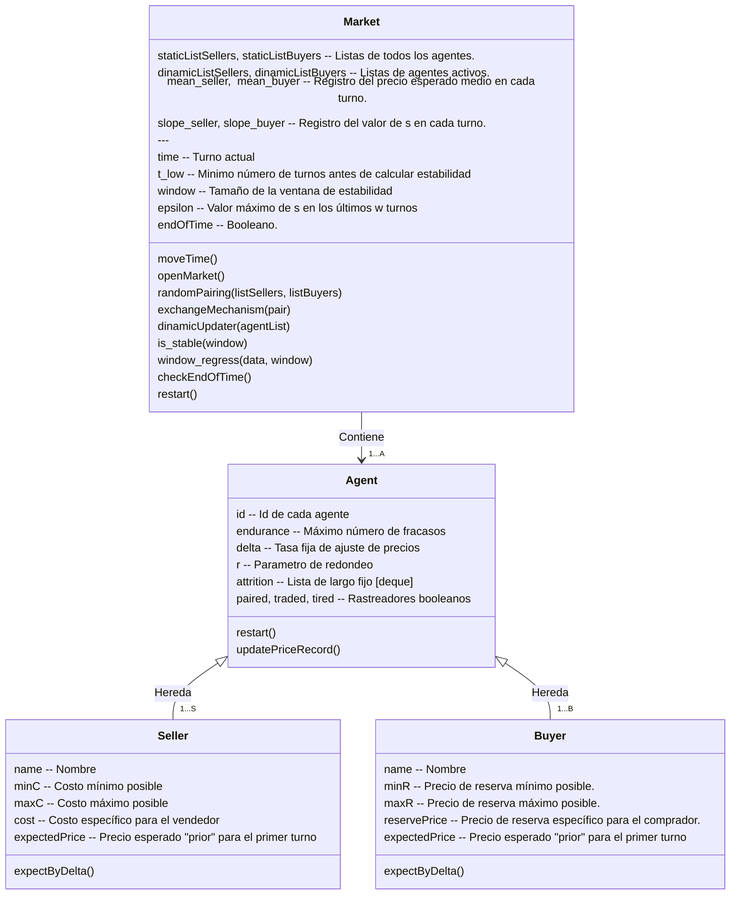
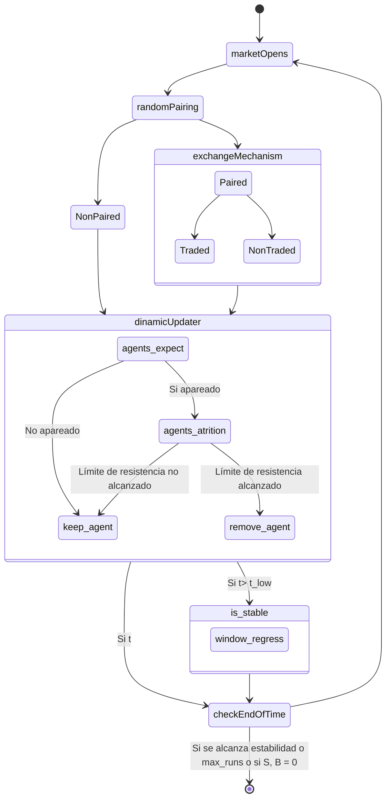

```mermaid
classDiagram
class Market{
	staticListSellers, staticListBuyers -- Listas de todos los agentes.
	dinamicListSellers, dinamicListBuyers -- Listas de agentes activos.
	mean_seller,  mean_buyer -- Registro del precio esperado medio en cada turno.
   	slope_seller, slope_buyer -- Registro del valor de s en cada turno.
    ---
    time -- Turno actual
    t_low -- Minimo número de turnos antes de calcular estabilidad
    window -- Tamaño de la ventana de estabilidad
    epsilon -- Valor máximo de s en los últimos w turnos
    endOfTime -- Booleano.
    
	moveTime()
	openMarket()
	randomPairing(listSellers, listBuyers)
	exchangeMechanism(pair)
	dinamicUpdater(agentList)
	is_stable(window)
	window_regress(data, window)
	checkEndOfTime()
	restart()
	}

class Agent{
	id -- Id de cada agente
	endurance -- Máximo número de fracasos
	delta -- Tasa fija de ajuste de precios
	r -- Parametro de redondeo
	attrition -- Lista de largo fijo [deque]
	paired, traded, tired -- Rastreadores booleanos

	restart()
	updatePriceRecord()
	}
          
class Seller{
	name -- Nombre
	minC -- Costo mínimo posible
	maxC -- Costo máximo posible
	cost --  Costo específico para el vendedor
	expectedPrice -- Precio esperado "prior" para el primer turno
	expectByDelta()
	}

class Buyer{
	name -- Nombre
	minR -- Precio de reserva mínimo posible.
	maxR -- Precio de reserva máximo posible.
	reservePrice -- Precio de reserva específico para el comprador.
	expectedPrice -- Precio esperado "prior" para el primer turno
	expectByDelta()
	}
Market --> "1...A" Agent : Contiene
Agent <|-- "1...S" Seller : Hereda
Agent <|-- "1...B" Buyer : Hereda
```

```mermaid
stateDiagram
    [*] --> marketOpens
    marketOpens --> randomPairing
    randomPairing --> exchangeMechanism
    randomPairing --> NonPaired
    state exchangeMechanism {
        Paired --> Traded
        Paired --> NonTraded
    }
    
    NonPaired --> dinamicUpdater
    exchangeMechanism --> dinamicUpdater
    state dinamicUpdater {
        agents_expect --> agents_atrition : Si apareado
        agents_expect --> keep_agent : No apareado
        agents_atrition --> remove_agent : Límite de resistencia alcanzado
        agents_atrition --> keep_agent : Límite de resistencia no alcanzado
    }
    
    dinamicUpdater --> checkEndOfTime : Si t<t_low
    dinamicUpdater --> is_stable : Si t> t_low
    state is_stable{
    window_regress 
    }
    
    is_stable --> checkEndOfTime
    checkEndOfTime --> [*] : Si se alcanza estabilidad o max_runs o si S, B = 0
    checkEndOfTime --> marketOpens 
```

