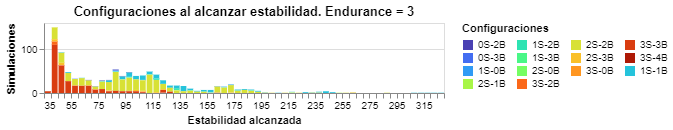
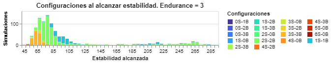
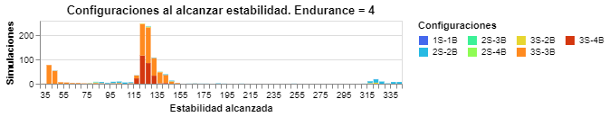
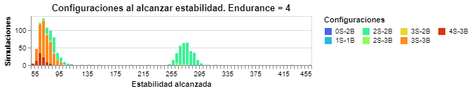
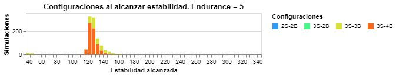
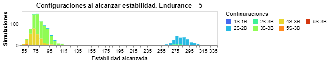
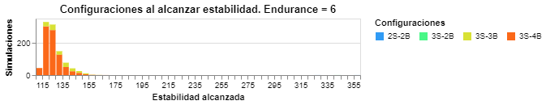
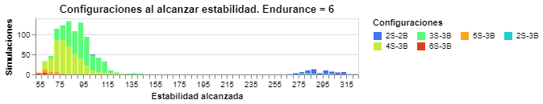

# Tablas

|  |  |      |
| :----------------------------------------------------------: | :----------------------------------------------------------: | ---- |
|  |  |      |
|  |  |      |
|  |  |      |
|      *Recopilado en 1000 iteraciones de $\{S=3; B=3\}$*      |      *Recopilado en 1000 iteraciones de $\{S=5; B=5\}$*      |      |

|  |  |      |
| :----------------------------------------------------------: | :----------------------------------------------------------: | ---- |
|  |  |      |
|  |  |      |
|  |  |      |
|      *Recopilado en 1000 iteraciones de $\{S=3; B=4\}$*      |      *Recopilado en 1000 iteraciones de $\{S=6; B=3\}$*      |      |

|  |  |      |
| :----------------------------------------------------------: | :----------------------------------------------------------: | ---- |
|  |  |      |
|  |  |      |
|  |  |      |
|      *Recopilado en 1000 iteraciones de $\{S=3; B=3\}$*      |      *Recopilado en 1000 iteraciones de $\{S=5; B=5\}$*      |      |

|  |      |  |
| :--------------------------------------------------: | ---- | :--------------------------------------------------: |
|  |      |  |
|  |      |  |
|  |      |  |
|  *Recopilado en 1000 iteraciones de $\{S=3; B=4\}$*  |      |  *Recopilado en 1000 iteraciones de $\{S=6; B=3\}$*  |

